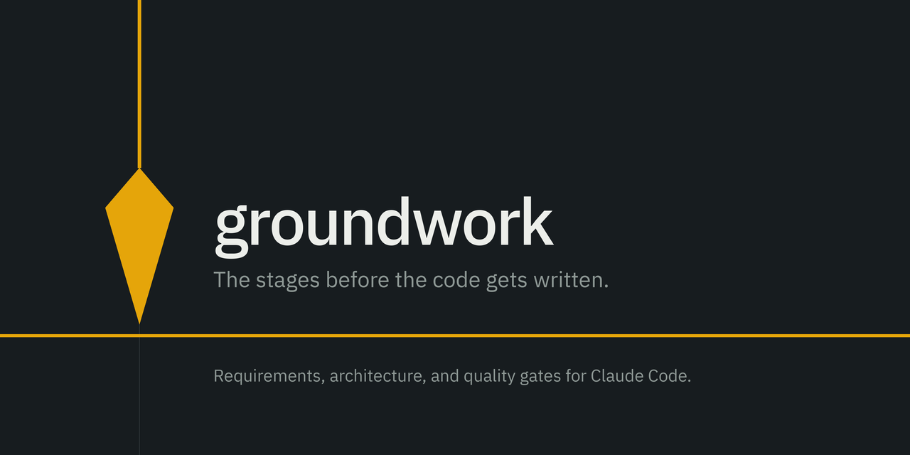

[](https://stormbreaker9000.github.io/groundwork/)

# groundwork

A Claude Code plugin that brings structure to software development — requirements gathering, planning, and SDLC discipline before you write a line of code.

> Built as an alternative to "vibe coding": lay the groundwork first.

## What it does

Groundwork intercepts vague implementation requests and guides you through a lightweight requirements process before anything gets built. Instead of jumping straight to code, you get atomic, validated requirement artifacts — each with a rationale and a fit criterion — that both you and Claude agree on before implementation starts.

## Installation

**From Claude Code:**

```
/plugin marketplace add https://github.com/Stormbreaker9000/groundwork
```

Then install the plugin:

```
/plugin install groundwork@groundwork-dev
```

## Usage

Run `/groundwork` in any Claude Code session to see available workflows.

When you make a vague request like *"build me a login form"* or *"add dark mode"*, the `requirements` skill will pause and ask clarifying questions before touching code.

## Workflows

| Workflow | Trigger | Description |
|---|---|---|
| `requirements` | "build X", "add Y", "make it do Z" | Turns a vague request into atomic, validated requirement artifacts under `.sdlc/requirements/` — functional and non-functional requirements, constraints, business rules, assumptions, a glossary and a Definition of Done |
| `design` | a validated requirement set exists | Turns requirements into an architecture under `.sdlc/design/` — components, interface contracts, MADR architecture decision records and C4 diagrams, each traced back to the requirements that motivated it |

Claude will not write code until you sign off.

## Documentation

Full documentation, including the content-rule reference, is published from this repository to
**https://stormbreaker9000.github.io/groundwork/**.

### Previewing the site locally

The site is built with a `/groundwork` base path, so plain `http://localhost:3000/` returns a 404 —
open `/groundwork/` instead.

```bash
cd site
npm install     # first time only
npm run dev     # http://localhost:3000/groundwork/
```

The Pagefind search index is produced by the `postbuild` step, not by `next dev`, so site search
returns nothing under `npm run dev`. To preview the exact static output that gets deployed, build it
and serve it from a directory where it sits under `groundwork/`:

```bash
cd site
npm run build
mkdir -p /tmp/gw-preview && ln -sfn "$PWD/out" /tmp/gw-preview/groundwork
python3 -m http.server 8000 --directory /tmp/gw-preview   # http://localhost:8000/groundwork/
```

### Deploying

`.github/workflows/pages.yml` deploys only on pushes to `main`, so a docs change reaches the
published site when its pull request merges — CI on the PR builds the site but publishes nothing.
To put a branch on the live site before merging, dispatch the workflow against that branch:

```bash
gh workflow run pages.yml --ref <branch>
```

That publishes to the real URL and stays there until the next push to `main` redeploys.

## Roadmap

- [x] Architecture design workflow
- [ ] Test planning workflow
- [ ] Release checklist workflow
- [ ] `PreToolUse` hooks to enforce requirements brief before implementation

## Plugin structure

```
groundwork/
├── .claude-plugin/       # Plugin manifests
├── skills/               # Markdown instruction sets (skill triggers)
├── commands/             # Slash commands (/groundwork)
├── hooks/                # Event-driven scripts (SessionStart)
├── agents/               # Dispatched subagents
├── lib/                  # Shared Python modules used by the linting/validation scripts
├── site/                 # Nextra documentation site, published to GitHub Pages
├── assets/               # Brand assets — the plumb-bob mark, icon and social preview
├── docs/                 # Internal planning docs (specs, plans, research) — not the published site
└── .github/              # CI and GitHub Pages deploy workflows
```

## License

MIT
