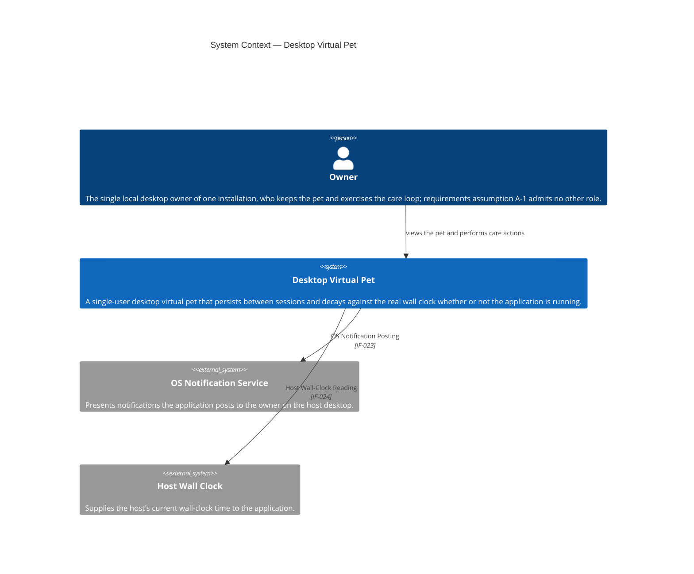

# System Context

```mermaid
C4Context
  title System Context — Desktop Virtual Pet
  Person(actor_owner, "Owner", "The single local desktop owner of one installation, who keeps the pet and exercises the care loop; requirements assumption A-1 admits no other role.")
  System(sys, "Desktop Virtual Pet", "A single-user desktop virtual pet that persists between sessions and decays against the real wall clock whether or not the application is running.")
  System_Ext(ext_cmp_018, "OS Notification Service", "Presents notifications the application posts to the owner on the host desktop.")
  System_Ext(ext_cmp_019, "Host Wall Clock", "Supplies the host's current wall-clock time to the application.")
  Rel(actor_owner, sys, "views the pet and performs care actions")
  Rel(sys, ext_cmp_018, "OS Notification Posting", "IF-023")
  Rel(sys, ext_cmp_019, "Host Wall-Clock Reading", "IF-024")
```
