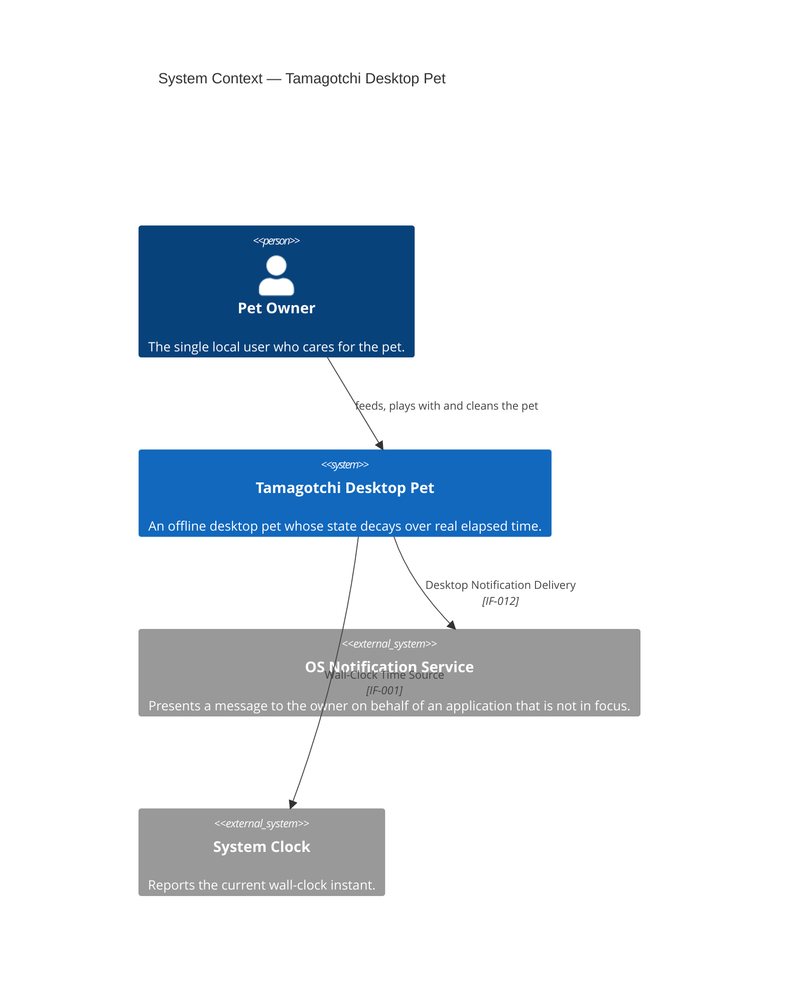

# System Context

```mermaid
C4Context
  title System Context — Tamagotchi Desktop Pet
  Person(actor_owner, "Pet Owner", "The single local user who cares for the pet.")
  System(sys, "Tamagotchi Desktop Pet", "An offline desktop pet whose state decays over real elapsed time.")
  System_Ext(ext_cmp_010, "OS Notification Service", "Presents a message to the owner on behalf of an application that is not in focus.")
  System_Ext(ext_cmp_011, "System Clock", "Reports the current wall-clock instant.")
  Rel(actor_owner, sys, "feeds, plays with and cleans the pet")
  Rel(sys, ext_cmp_011, "Wall-Clock Time Source", "IF-001")
  Rel(sys, ext_cmp_010, "Desktop Notification Delivery", "IF-012")
```
