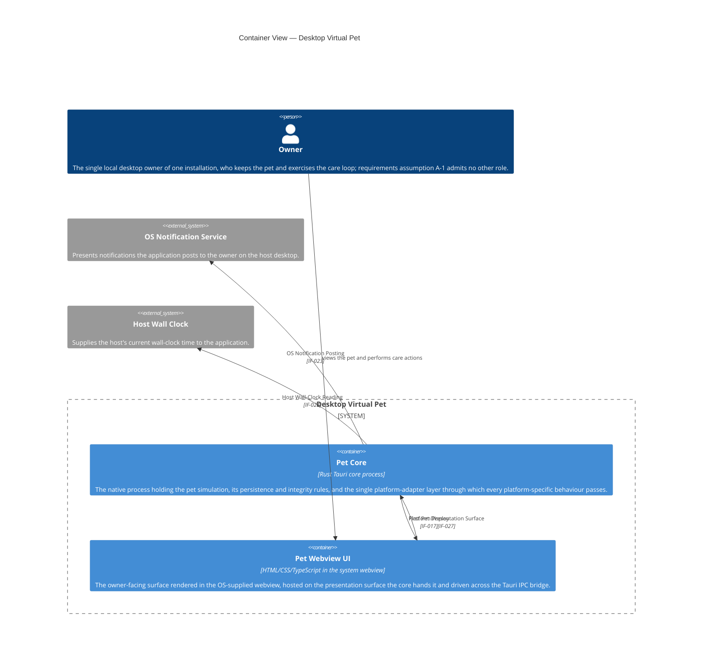

# Container View

```mermaid
C4Container
  title Container View — Desktop Virtual Pet
  Person(actor_owner, "Owner", "The single local desktop owner of one installation, who keeps the pet and exercises the care loop; requirements assumption A-1 admits no other role.")
  System_Boundary(sys, "Desktop Virtual Pet") {
    Container(ctr_pet_core, "Pet Core", "Rust Tauri core process", "The native process holding the pet simulation, its persistence and integrity rules, and the single platform-adapter layer through which every platform-specific behaviour passes.")
    Container(ctr_webview_ui, "Pet Webview UI", "HTML/CSS/TypeScript in the system webview", "The owner-facing surface rendered in the OS-supplied webview, hosted on the presentation surface the core hands it and driven across the Tauri IPC bridge.")
  }
  System_Ext(ext_cmp_018, "OS Notification Service", "Presents notifications the application posts to the owner on the host desktop.")
  System_Ext(ext_cmp_019, "Host Wall Clock", "Supplies the host's current wall-clock time to the application.")
  Rel(actor_owner, ctr_webview_ui, "views the pet and performs care actions")
  Rel(ctr_pet_core, ctr_webview_ui, "Pet View Refresh", "IF-030")
  Rel(ctr_pet_core, ctr_webview_ui, "First Pet Display", "IF-017")
  Rel(ctr_webview_ui, ctr_pet_core, "Live Pet State Access", "IF-002")
  Rel(ctr_webview_ui, ctr_pet_core, "Care Action Application", "IF-008")
  Rel(ctr_webview_ui, ctr_pet_core, "Care Reminder Preference", "IF-028")
  Rel(ctr_webview_ui, ctr_pet_core, "Platform Presentation Surface", "IF-027")
  Rel(ctr_pet_core, ext_cmp_018, "OS Notification Posting", "IF-023")
  Rel(ctr_pet_core, ext_cmp_019, "Host Wall-Clock Reading", "IF-024")
```
