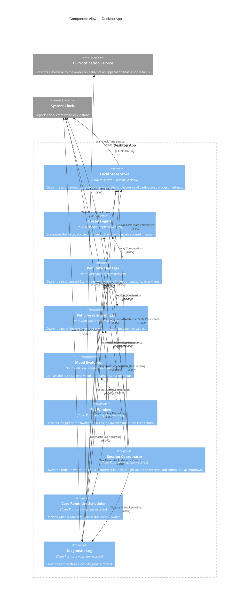

# Component View — Desktop App

```mermaid
C4Component
  title Component View — Desktop App
  Container_Boundary(ctr_desktop_app, "Desktop App") {
    Component(cmp_001, "Local State Store", "Tauri Rust core + system webview", "Owns the application's durable local state as the single source of truth across process lifetimes.")
    Component(cmp_002, "Decay Engine", "Tauri Rust core + system webview", "Computes the Decay accrued by a pet's Stats over a given elapsed interval.")
    Component(cmp_003, "Pet State Manager", "Tauri Rust core + system webview", "Owns the pet's current Stat values as the single in-session authority over them.")
    Component(cmp_004, "Pet Lifecycle Manager", "Tauri Rust core + system webview", "Owns the pet's lifecycle state and every transition between its values.")
    Component(cmp_005, "Mood Evaluator", "Tauri Rust core + system webview", "Derives the pet's current Mood as a named semantic value.")
    Component(cmp_006, "Pet Window", "Tauri Rust core + system webview", "Presents the pet to the owner and turns the owner's input into care actions.")
    Component(cmp_007, "Session Coordinator", "Tauri Rust core + system webview", "Owns the order in which the pet is restored at launch, caught up to the present, and committed at shutdown.")
    Component(cmp_008, "Care Reminder Scheduler", "Tauri Rust core + system webview", "Decides when a care reminder is due for the owner.")
    Component(cmp_009, "Diagnostic Log", "Tauri Rust core + system webview", "Owns the application's local diagnostic record.")
  }
  System_Ext(ext_cmp_010, "OS Notification Service", "Presents a message to the owner on behalf of an application that is not in focus.")
  System_Ext(ext_cmp_011, "System Clock", "Reports the current wall-clock instant.")
  Rel(cmp_001, cmp_009, "Diagnostic Log Recording", "IF-002")
  Rel(cmp_001, ext_cmp_011, "Wall-Clock Time Source", "IF-001")
  Rel(cmp_003, cmp_001, "Durable Pet State Persistence", "IF-003")
  Rel(cmp_003, cmp_002, "Decay Computation", "IF-004")
  Rel(cmp_003, cmp_004, "Pet Lifecycle State", "IF-006")
  Rel(cmp_003, cmp_009, "Diagnostic Log Recording", "IF-002")
  Rel(cmp_003, ext_cmp_011, "Wall-Clock Time Source", "IF-001")
  Rel(cmp_004, cmp_003, "Pet Stat Observation", "IF-005")
  Rel(cmp_004, cmp_009, "Diagnostic Log Recording", "IF-002")
  Rel(cmp_004, ext_cmp_011, "Wall-Clock Time Source", "IF-001")
  Rel(cmp_005, cmp_003, "Pet Stat Observation", "IF-005")
  Rel(cmp_005, cmp_004, "Pet Lifecycle State", "IF-006")
  Rel(cmp_006, cmp_003, "Pet Stat Observation", "IF-005")
  Rel(cmp_006, cmp_003, "Care Action Application", "IF-008")
  Rel(cmp_006, cmp_004, "Pet Lifecycle State", "IF-006")
  Rel(cmp_006, cmp_005, "Mood Evaluation", "IF-007")
  Rel(cmp_006, cmp_008, "Care Reminder Preference Control", "IF-010")
  Rel(cmp_007, cmp_001, "Durable Pet State Persistence", "IF-003")
  Rel(cmp_007, cmp_002, "Decay Computation", "IF-004")
  Rel(cmp_007, cmp_003, "Session State Seeding", "IF-009")
  Rel(cmp_007, cmp_009, "Diagnostic Log Recording", "IF-002")
  Rel(cmp_007, ext_cmp_011, "Wall-Clock Time Source", "IF-001")
  Rel(cmp_008, cmp_001, "Reminder Preference Persistence", "IF-011")
  Rel(cmp_008, cmp_003, "Pet Stat Observation", "IF-005")
  Rel(cmp_008, ext_cmp_010, "Desktop Notification Delivery", "IF-012")
  Rel(cmp_009, ext_cmp_011, "Wall-Clock Time Source", "IF-001")
```
