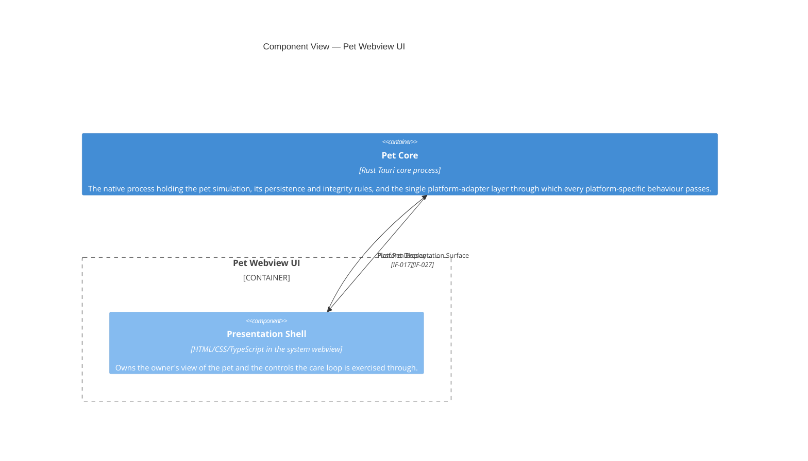

# Component View — Pet Webview UI

```mermaid
C4Component
  title Component View — Pet Webview UI
  Container_Boundary(ctr_webview_ui, "Pet Webview UI") {
    Component(cmp_016, "Presentation Shell", "HTML/CSS/TypeScript in the system webview", "Owns the owner's view of the pet and the controls the care loop is exercised through.")
  }
  Container(ctr_pet_core, "Pet Core", "Rust Tauri core process", "The native process holding the pet simulation, its persistence and integrity rules, and the single platform-adapter layer through which every platform-specific behaviour passes.")
  Rel(ctr_pet_core, cmp_016, "Pet View Refresh", "IF-030")
  Rel(ctr_pet_core, cmp_016, "First Pet Display", "IF-017")
  Rel(cmp_016, ctr_pet_core, "Live Pet State Access", "IF-002")
  Rel(cmp_016, ctr_pet_core, "Care Action Application", "IF-008")
  Rel(cmp_016, ctr_pet_core, "Care Reminder Preference", "IF-028")
  Rel(cmp_016, ctr_pet_core, "Platform Presentation Surface", "IF-027")
```
