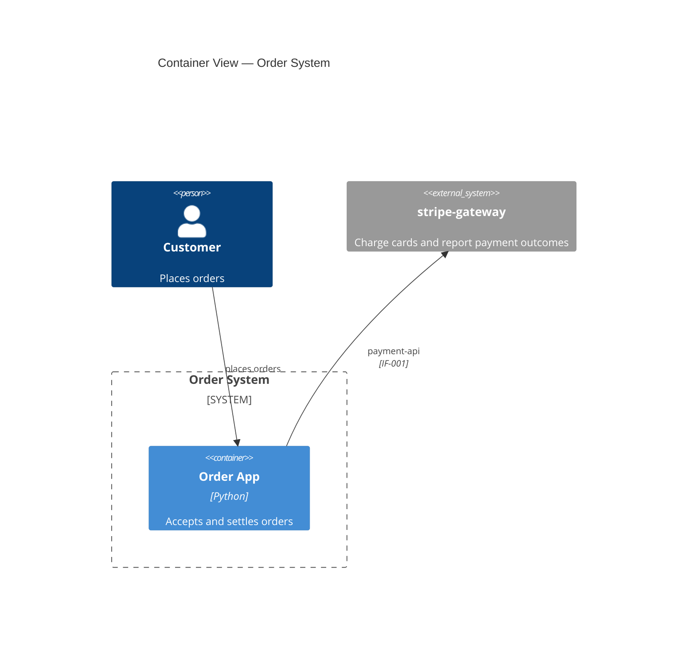
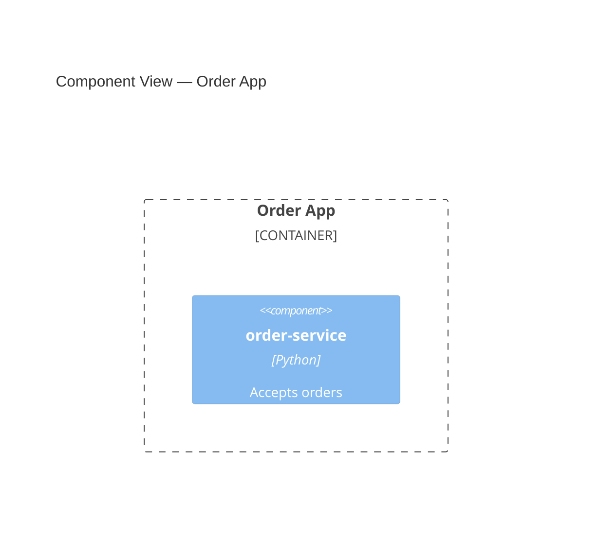

# C4 Diagram Generation Implementation Plan

> **For agentic workers:** REQUIRED SUB-SKILL: Use superpowers:subagent-driven-development (recommended) or superpowers:executing-plans to implement this plan task-by-task. Steps use checkbox (`- [ ]`) syntax for tracking.

**Goal:** Emit C4 Context, Container and Component views as Mermaid diagrams into `.sdlc/design/diagrams/`, generated deterministically from component and interface frontmatter and gated by the existing structural validator.

**Architecture:** A new `c4-generator` agent runs at Stage 9.6 and returns judgment only — container grouping and actors — as a `draft_diagram_model`. The design formatter then runs `generate_c4.py` over the files it has just written, which projects the `CMP.depends_on → IF.provider` graph into three C4 levels, back-fills `traces_to.diagrams`, and hands everything to the single structural gate. No LLM authors Mermaid; the diagram cannot disagree with the frontmatter because it is a projection of it.

**Tech Stack:** Python 3 (stdlib only for the scripts; `pyyaml` + `jsonschema` optional, with the existing stdlib fallback), pytest, JSON Schema draft 2020-12, Mermaid C4 notation.

**Spec:** `docs/superpowers/specs/2026-08-22-m2-c4-diagram-generation-design.md`

## Global Constraints

- **Stdlib only in `generate_c4.py`.** No new dependency, no `npx`, no network. `pyyaml`/`jsonschema` stay optional for the validator exactly as today.
- **Deterministic output.** Same design set + same model ⇒ byte-identical diagrams. Sort every collection before emitting. Never call `datetime.now()` for artifact content — `created_at` arrives via `--created-at`.
- **The formatter stays the single writer and `validate_design.py` the single structural gate.** Nothing in this plan writes a design artifact outside the formatter, and nothing runs the validator twice.
- **Alias rule (D4), used verbatim by both the generator and the validator:**
  | Element | Alias | Example |
  |---|---|---|
  | Internal component | `id.lower().replace("-", "_")` | `CMP-001` → `cmp_001` |
  | External component | `"ext_" + <internal rule>` | `CMP-010` → `ext_cmp_010` |
  | Container | `"ctr_" + key.replace("-", "_")` | `desktop-app` → `ctr_desktop_app` |
  | Actor | `"actor_" + key.replace("-", "_")` | `owner` → `actor_owner` |
  | The system | the literal `sys` | — |
  The rule is total and reversible: strip a leading `ext_`, upper-case, swap `_` for `-`.
- **Diagram filenames** follow the existing `<ID>-<kebab-title>.md` convention: `DIA-001-system-context.md`, `DIA-002-container-view.md`, `DIA-003-component-view-<container-key>.md`. (The spec's option preview showed `DIA-002-containers.md`; the naming convention wins.)
- **Commit convention:** `feat(sto-101): …` / `test(sto-101): …` / `docs(sto-101): …`, wrapped at 72 columns in the body.
- **Prose in `.md` wraps at 79 columns.** Python wraps at 88.
- **Run the whole suite from the repo root** with `python3 -m pytest -q`. It is 210 tests green at the start of this plan; it must be green at the end of every task.

---

## File Structure

**New files**

| File | Responsibility |
|---|---|
| `skills/design/scripts/generate_c4.py` | Load a design set, validate the model against it, project the graph into three C4 levels, write `diagrams/`, print a JSON summary. |
| `skills/design/scripts/tests/test_generate_c4.py` | Golden-file tests for emission plus model-validation failures. |
| `skills/design/scripts/tests/fixtures/c4/single-container/` | Input design set + expected diagrams for the degenerate 3-file case. |
| `skills/design/scripts/tests/fixtures/c4/multi-container/` | Input design set + expected diagrams with cross-container edges and an external. |
| `agents/c4-generator.md` | The Stage 9.6 agent: container grouping and actors, nothing else. |

**Modified files**

| File | Change |
|---|---|
| `skills/design/schema/design.schema.json` | `DIA` in the id pattern, `diagram` in the type enum, a fourth `allOf` branch. |
| `skills/design/scripts/validate_design.py` | Drop `diagrams` from `SKIP_DIRNAMES`; `DIA`→`diagram` in `PREFIX_TO_TYPE`; fallback field knowledge; per-file Mermaid body checks; set-level diagram checks. |
| `skills/design/scripts/tests/test_validate_design.py` | Diagram accept/reject cases; the skip-subtree test loses its diagram assertion. |
| `skills/design/scripts/tests/fixtures/valid/diagrams/c4-container.md` | Replaced by a real `DIA-` artifact — it currently has no frontmatter and would fail the moment discovery reaches it. |
| `agents/design-orchestrator.md` | Stage 9.6, the model invariant, retire Stage 12, redraw the pipeline overview. |
| `agents/design-formatter.md` | Run the generator, back-fill `traces_to.diagrams`, index the diagrams, extend `formatter_result`. |
| `skills/design/SKILL.md` | Diagrams in the Step 2 summary; Step 4 ordering; delete the "does not produce C4 diagrams" paragraph. |
| `skills/design/scripts/README.md` | A `generate_c4.py` section. |
| `docs/requirements/examples/tamagotchi/design/diagrams/` | The end-to-end smoke test output, plus a README note. |

---

### Task 1: Diagram artifacts exist and are validated

Adds the schema branch and turns discovery on. Nothing generates diagrams yet — this task makes a hand-written one legal and a malformed one fail.

**Files:**
- Modify: `skills/design/schema/design.schema.json`
- Modify: `skills/design/scripts/validate_design.py:91` (`SKIP_DIRNAMES`), `:96` (`PREFIX_TO_TYPE`), `:142` (`_FALLBACK_REQUIRED_BY_TYPE`), `:151` (`_FALLBACK_ENUMS`)
- Modify: `skills/design/scripts/tests/fixtures/valid/diagrams/c4-container.md` → delete, replace with `DIA-002-container-view.md`
- Test: `skills/design/scripts/tests/test_validate_design.py`

**Interfaces:**
- Consumes: nothing.
- Produces: the `diagram` artifact type — `level: context|container|component`, `container: <kebab-key>` required when and only when `level: component`. Every later task depends on this shape.

- [ ] **Step 1: Replace the placeholder diagram fixture**

The valid fixture set is `CMP-001 order-service` (**internal**, `depends_on: [IF-001]`), `CMP-002 stripe-gateway` (**external**, the provider of `IF-001`), `IF-001 payment-api`, and `ADR-001`. Every alias below resolves against that set — from Task 3 onward the validator checks exactly that, so inventing a `CMP-003` here would break the valid set the moment the set-level checks land.

Delete `skills/design/scripts/tests/fixtures/valid/diagrams/c4-container.md` and create `skills/design/scripts/tests/fixtures/valid/diagrams/DIA-002-container-view.md`:

```markdown
---
id: DIA-002
type: diagram
title: Container View
description: The deployable units of the order system and the external systems they reach.
level: container
traces_from: [FR-001]
traces_to: {}
status: draft
confidence: high
created_at: 2026-08-22
---

# Container View


```

Then fix the stale downstream trace both components carry. `CMP-001-order-service.md` and `CMP-002-stripe-gateway.md` both hold:

```yaml
  diagrams:
    - c4-container
```

which named the old frontmatter-free file. Change both to `- DIA-002`. Nothing validates that edge yet — `traces_to.diagrams` resolution is not one of the spec's D9 checks — but leaving a dangling name in the set the whole suite is measured against invites a false read later.

- [ ] **Step 2: Write the failing tests**

Append to `skills/design/scripts/tests/test_validate_design.py`:

```python
# ---------------------------------------------------------------------------
# Diagram artifacts (STO-101)
# ---------------------------------------------------------------------------
def test_valid_diagram_is_discovered_and_passes(capsys):
    """diagrams/ is no longer skipped: a well-formed DIA- artifact validates."""
    code = run(VALID_DIR)
    out = capsys.readouterr().out
    assert code == 0, out
    assert "DIA-002" in out


def test_diagram_bad_level_fails(tmp_path, capsys):
    design_dir = _copy_valid(tmp_path)
    path = design_dir / "diagrams" / "DIA-002-container-view.md"
    path.write_text(path.read_text().replace("level: container", "level: deployment"))
    code = run(str(design_dir))
    assert code != 0
    assert "level" in capsys.readouterr().out


def test_component_level_diagram_requires_container(tmp_path, capsys):
    """level: component names the container it depicts; without it the file
    claims to show the internals of nothing in particular."""
    design_dir = _copy_valid(tmp_path)
    path = design_dir / "diagrams" / "DIA-002-container-view.md"
    path.write_text(path.read_text().replace("level: container", "level: component"))
    code = run(str(design_dir))
    assert code != 0
    assert "container" in capsys.readouterr().out


def test_non_component_level_rejects_container(tmp_path, capsys):
    design_dir = _copy_valid(tmp_path)
    path = design_dir / "diagrams" / "DIA-002-container-view.md"
    path.write_text(
        path.read_text().replace("level: container", "level: container\ncontainer: app")
    )
    code = run(str(design_dir))
    assert code != 0


def test_diagram_prefix_type_mismatch_fails(tmp_path, capsys):
    design_dir = _copy_valid(tmp_path)
    path = design_dir / "diagrams" / "DIA-002-container-view.md"
    path.write_text(path.read_text().replace("type: diagram", "type: component"))
    code = run(str(design_dir))
    assert code != 0
    assert "prefix" in capsys.readouterr().out
```

Add the shared helper near `run()` at the top of the file:

```python
def _copy_valid(tmp_path):
    """A writable copy of the valid fixture set, for mutate-then-fail cases."""
    design_dir = tmp_path / "design"
    shutil.copytree(VALID_DIR, design_dir)
    return design_dir
```

And update the existing `test_skip_files_and_subtrees_are_ignored` — its `assert "c4-container" not in out` asserted the old behaviour and is now wrong:

```python
def test_skip_files_and_subtrees_are_ignored(capsys):
    """assumptions.md, drivers.md and index.yaml must not be validated as
    artifacts. adr/ IS validated as of STO-100, and diagrams/ as of STO-101."""
    run(VALID_DIR)
    out = capsys.readouterr().out
    assert "assumptions.md" not in out
    assert "drivers.md" not in out
    assert "index.yaml" not in out
    assert "ADR-001" in out
    assert "DIA-002" in out
```

- [ ] **Step 3: Run them to verify they fail**

Run: `python3 -m pytest skills/design/scripts/tests/test_validate_design.py -q -k diagram`
Expected: FAIL — the diagram file is still skipped by discovery, so `DIA-002` never appears in the report and the mutation tests exit 0.

- [ ] **Step 4: Add the schema branch**

In `skills/design/schema/design.schema.json`:

Extend the id pattern and the type enum:

```json
    "id": {
      "type": "string",
      "description": "Categorical, zero-padded, stable ID. Prefix encodes type: CMP->component, IF->interface, ADR->adr, DIA->diagram. An optional uppercase category infix is allowed (e.g. CMP-AUTH-004).",
      "pattern": "^(CMP|IF|ADR|DIA)(-[A-Z0-9]+)*-[0-9]{3,}$"
    },
    "type": {
      "type": "string",
      "description": "Design-artifact category.",
      "enum": [
        "component",
        "interface",
        "adr",
        "diagram"
      ]
    },
```

Append a fourth entry to `allOf`, after the ADR branch:

```json
    {
      "$comment": "Diagram branch (STO-101). `level` names which C4 view this is; `container` names the container a component-level view depicts and is meaningless on the other two levels, so it is required there and forbidden elsewhere. Diagram bodies are generated by generate_c4.py from CMP/IF frontmatter; the Mermaid itself is checked by validate_design.py, not here.",
      "if": {
        "properties": {
          "type": {
            "const": "diagram"
          }
        },
        "required": [
          "type"
        ]
      },
      "then": {
        "required": [
          "level"
        ],
        "properties": {
          "level": {
            "type": "string",
            "description": "C4 level. Determines the Mermaid header directive: context->C4Context, container->C4Container, component->C4Component.",
            "enum": [
              "context",
              "container",
              "component"
            ]
          },
          "container": {
            "type": "string",
            "description": "The container key whose internals this view depicts. Present only on level: component.",
            "pattern": "^[a-z0-9]+(-[a-z0-9]+)*$"
          }
        },
        "allOf": [
          {
            "$comment": "A component view depicts exactly one container, and must say which.",
            "if": {
              "properties": {
                "level": {
                  "const": "component"
                }
              },
              "required": [
                "level"
              ]
            },
            "then": {
              "required": [
                "container"
              ]
            },
            "else": {
              "not": {
                "required": [
                  "container"
                ]
              }
            }
          }
        ]
      }
    }
```

- [ ] **Step 5: Turn on discovery and teach the fallback path**

In `skills/design/scripts/validate_design.py`:

```python
# Whole subtrees another stage owns in a non-artifact format. Empty as of
# STO-101: diagrams/ holds DIA- artifacts and is discovered like adr/.
SKIP_DIRNAMES: set = set()
```

```python
PREFIX_TO_TYPE = {
    "CMP": "component",
    "IF": "interface",
    "ADR": "adr",
    "DIA": "diagram",
}
```

```python
_FALLBACK_REQUIRED_BY_TYPE = {
    "component": ["responsibility", "boundary", "depends_on"],
    # `interaction` is per-operation as of STO-216; checked by
    # `_fallback_check_operations`, not by this flat list.
    "interface": ["provider", "operations", "error_modes"],
    # `chosen_option`/`considered_options` are conditional on decision_status,
    # which this path cannot express — the schema is the source of truth.
    "adr": ["decision_status"],
    # `container` is conditional on level, likewise not expressible here.
    "diagram": ["level"],
}
```

```python
_FALLBACK_ENUMS = {
    "type": {"component", "interface", "adr", "diagram"},
    "boundary": {"internal", "external"},
    "level": {"context", "container", "component"},
    ...
}
```

Also update the module docstring's directory listing — the line `diagrams/ *.md (skipped — STO-101 owns the format)` becomes:

```
      diagrams/      DIA-XXX-*.md   (C4 views, generated by generate_c4.py)
```

and the numbered list item 1 loses "skipping the ``diagrams/`` subtree and".

- [ ] **Step 6: Run the tests to verify they pass**

Run: `python3 -m pytest skills/design/scripts/tests/test_validate_design.py -q`
Expected: PASS, all cases.

- [ ] **Step 7: Run the whole suite**

Run: `python3 -m pytest -q`
Expected: PASS. Watch specifically for `test_validate_traceability.py` — it walks the same fixture sets and now sees a `DIA-` artifact where it saw none.

- [ ] **Step 8: Commit**

```bash
git add skills/design/schema/design.schema.json \
        skills/design/scripts/validate_design.py \
        skills/design/scripts/tests/
git commit -m "feat(sto-101): diagram artifacts, and the schema branch behind them"
```

---

### Task 2: Mermaid body checks

Per-file structure: one fenced block, the right header for the level, balanced delimiters, and no relation pointing at an alias the file never declared.

**Files:**
- Modify: `skills/design/scripts/validate_design.py` (new constants + `check_diagram_body`, wired into `validate()`)
- Test: `skills/design/scripts/tests/test_validate_design.py`

**Interfaces:**
- Consumes: the `diagram` type and `level` field from Task 1.
- Produces: `check_diagram_body(path: str, level: Optional[str]) -> Tuple[List[str], Set[str], Set[str]]` — errors, the aliases the file declares, and the `IF-` IDs its relations cite. Task 3 consumes the second and third return values.

- [ ] **Step 1: Write the failing tests**

Append to `test_validate_design.py`:

```python
def test_diagram_without_mermaid_block_fails(tmp_path, capsys):
    design_dir = _copy_valid(tmp_path)
    path = design_dir / "diagrams" / "DIA-002-container-view.md"
    body = path.read_text().split("```mermaid")[0]
    path.write_text(body)
    code = run(str(design_dir))
    assert code != 0
    assert "mermaid" in capsys.readouterr().out


def test_diagram_header_must_match_level(tmp_path, capsys):
    """A file that says level: container and draws a C4Context is two
    different claims about the same diagram."""
    design_dir = _copy_valid(tmp_path)
    path = design_dir / "diagrams" / "DIA-002-container-view.md"
    path.write_text(path.read_text().replace("C4Container", "C4Context"))
    code = run(str(design_dir))
    assert code != 0
    out = capsys.readouterr().out
    assert "C4Container" in out and "C4Context" in out


def test_diagram_rel_to_undeclared_alias_fails(tmp_path, capsys):
    design_dir = _copy_valid(tmp_path)
    path = design_dir / "diagrams" / "DIA-002-container-view.md"
    path.write_text(
        path.read_text().replace(
            'Rel(actor_customer, ctr_app, "places orders")',
            'Rel(actor_customer, ctr_ghost, "places orders")',
        )
    )
    code = run(str(design_dir))
    assert code != 0
    assert "ctr_ghost" in capsys.readouterr().out


def test_diagram_unbalanced_delimiters_fail(tmp_path, capsys):
    design_dir = _copy_valid(tmp_path)
    path = design_dir / "diagrams" / "DIA-002-container-view.md"
    path.write_text(
        path.read_text().replace(
            '"stripe-gateway", "Charge cards',
            '"stripe-gateway, "Charge cards',
        )
    )
    code = run(str(design_dir))
    assert code != 0


def test_two_mermaid_blocks_fail(tmp_path, capsys):
    """One diagram per file is the atomic-artifact rule, applied to bodies."""
    design_dir = _copy_valid(tmp_path)
    path = design_dir / "diagrams" / "DIA-002-container-view.md"
    path.write_text(path.read_text() + "\n```mermaid\nC4Container\n```\n")
    code = run(str(design_dir))
    assert code != 0
```

- [ ] **Step 2: Run them to verify they fail**

Run: `python3 -m pytest skills/design/scripts/tests/test_validate_design.py -q -k "mermaid or header or undeclared or unbalanced or blocks"`
Expected: FAIL — nothing reads a diagram body yet, so every mutation still exits 0.

- [ ] **Step 3: Add the body checker**

In `validate_design.py`, after `check_adr_headings`:

```python
# Mermaid C4 body checks (STO-101). The header directive each `level` must
# open with — a file that disagrees with itself is two claims about one
# diagram.
LEVEL_TO_HEADER = {
    "context": "C4Context",
    "container": "C4Container",
    "component": "C4Component",
}

_MERMAID_BLOCK_RE = re.compile(r"^```mermaid\s*\n(.*?)^```\s*$", re.DOTALL | re.MULTILINE)

# Element declarations introduce an alias; relations consume one. Both are
# `Keyword(alias, ...)`, so one regex with a keyword group serves both.
_DECL_RE = re.compile(
    r"^\s*(Person|Person_Ext|System|System_Ext|System_Boundary|Container"
    r"|Container_Ext|Container_Boundary|Component|Component_Ext)"
    r"\(\s*([A-Za-z0-9_]+)\s*,"
)
_REL_RE = re.compile(
    r"^\s*(?:Rel|BiRel|Rel_Back|Rel_U|Rel_D|Rel_L|Rel_R|Rel_Up|Rel_Down"
    r"|Rel_Left|Rel_Right)"
    r"\(\s*([A-Za-z0-9_]+)\s*,\s*([A-Za-z0-9_]+)\s*[,)]"
)
_INTERFACE_REF_RE = re.compile(r"\b(IF(?:-[A-Z0-9]+)*-[0-9]{3,})\b")


def check_diagram_body(path, level):
    """Gate one diagram body's Mermaid block.

    Returns ``(errors, declared_aliases, interface_refs)``. The last two are
    what ``cross_file_checks`` resolves against the artifact set — parsed here
    because this is the only pass that reads the body.
    """
    errors = []
    try:
        with open(path, "r", encoding="utf-8") as handle:
            text = handle.read()
    except (OSError, UnicodeDecodeError) as exc:
        return [f"could not read diagram body: {exc}"], set(), set()

    blocks = _MERMAID_BLOCK_RE.findall(text)
    if not blocks:
        return ["body has no ```mermaid block"], set(), set()
    if len(blocks) > 1:
        errors.append(
            f"body has {len(blocks)} ```mermaid blocks — one diagram per file"
        )
    block = blocks[0]

    lines = [ln for ln in block.splitlines() if ln.strip()]
    expected_header = LEVEL_TO_HEADER.get(level) if level else None
    header = lines[0].strip() if lines else ""
    if expected_header and header != expected_header:
        errors.append(
            f"level '{level}' requires header '{expected_header}', "
            f"but the block opens with '{header or '(empty)'}'"
        )

    declared = set()
    refs = set()
    endpoints = []
    for line in lines:
        if line.count("(") != line.count(")") or line.count('"') % 2:
            errors.append(f"unbalanced quotes or parentheses: {line.strip()}")
            continue
        decl = _DECL_RE.match(line)
        if decl:
            declared.add(decl.group(2))
        rel = _REL_RE.match(line)
        if rel:
            endpoints.extend([rel.group(1), rel.group(2)])
            refs.update(_INTERFACE_REF_RE.findall(line))

    for alias in sorted(set(endpoints)):
        if alias not in declared:
            errors.append(f"relation endpoint '{alias}' is not declared in this diagram")

    return errors, declared, refs
```

Note `Container_Boundary(alias, "label") {` closes its paren on the same line, so the balance check passes and the trailing `{` is ignored — braces are not counted, because the block spans lines.

- [ ] **Step 4: Stash the parse results on the file and wire it in**

Extend `DesignFile` so Task 3 can reach the aliases:

```python
class DesignFile(ArtifactFile):
    """A parsed design artifact. ``design_id`` reads the generic ``artifact_id``."""

    def __init__(self, path):
        super().__init__(path)
        # Populated for `type: diagram` only, by check_diagram_body (STO-101).
        self.diagram_aliases: set = set()
        self.diagram_interface_refs: set = set()
```

In `validate()`, alongside the existing ADR hook:

```python
        if data.get("type") == "adr":
            df.errors.extend(check_adr_headings(path))
        if data.get("type") == "diagram":
            body_errors, aliases, refs = check_diagram_body(path, data.get("level"))
            df.errors.extend(body_errors)
            df.diagram_aliases = aliases
            df.diagram_interface_refs = refs
```

Confirm `ArtifactFile.__init__` takes only `path`; if its signature differs, mirror it exactly rather than guessing:

Run: `sed -n '62,90p' lib/artifact_core.py`

- [ ] **Step 5: Run the tests to verify they pass**

Run: `python3 -m pytest skills/design/scripts/tests/test_validate_design.py -q`
Expected: PASS.

- [ ] **Step 6: Run the whole suite**

Run: `python3 -m pytest -q`
Expected: PASS.

- [ ] **Step 7: Commit**

```bash
git add skills/design/scripts/validate_design.py skills/design/scripts/tests/
git commit -m "feat(sto-101): Mermaid body checks for diagram artifacts"
```

---

### Task 3: Set-level diagram checks

The check STO-102's description named and could not ship: a diagram that contradicts the artifact set. An error, not a warning — a wrong diagram is worse than a missing one, because it will be believed.

**Files:**
- Modify: `skills/design/scripts/validate_design.py` (`cross_file_checks`)
- Test: `skills/design/scripts/tests/test_validate_design.py`

**Interfaces:**
- Consumes: `DesignFile.diagram_aliases` / `.diagram_interface_refs` from Task 2.
- Produces: nothing later tasks import; this is the terminal gate for diagrams.

- [ ] **Step 1: Write the failing tests**

```python
def test_diagram_alias_must_resolve_to_a_component(tmp_path, capsys):
    design_dir = _copy_valid(tmp_path)
    path = design_dir / "diagrams" / "DIA-002-container-view.md"
    path.write_text(path.read_text().replace("ext_cmp_002", "ext_cmp_404"))
    code = run(str(design_dir))
    assert code != 0
    assert "CMP-404" in capsys.readouterr().out


def test_diagram_alias_boundary_must_match(tmp_path, capsys):
    """ext_ claims the component is external. CMP-001 is internal, so the
    diagram and the set disagree about where the boundary runs."""
    design_dir = _copy_valid(tmp_path)
    path = design_dir / "diagrams" / "DIA-002-container-view.md"
    path.write_text(path.read_text().replace("ext_cmp_002", "ext_cmp_001"))
    code = run(str(design_dir))
    assert code != 0
    assert "boundary" in capsys.readouterr().out


def test_diagram_interface_ref_must_resolve(tmp_path, capsys):
    design_dir = _copy_valid(tmp_path)
    path = design_dir / "diagrams" / "DIA-002-container-view.md"
    path.write_text(path.read_text().replace('"IF-001"', '"IF-999"'))
    code = run(str(design_dir))
    assert code != 0
    assert "IF-999" in capsys.readouterr().out


def test_component_view_covering_every_component_passes(tmp_path):
    """CMP-001 is the set's only internal component, and this view draws it."""
    design_dir = _copy_valid(tmp_path)
    (design_dir / "diagrams" / "DIA-003-component-view-order-app.md").write_text(
        _COMPONENT_VIEW_FIXTURE
    )
    assert run(str(design_dir)) == 0


def test_component_drawn_in_no_component_view_fails(tmp_path, capsys):
    """Once any component view exists, a component in none of them is
    invisible — the set claims a decomposition it never draws."""
    design_dir = _copy_valid(tmp_path)
    (design_dir / "diagrams" / "DIA-003-component-view-order-app.md").write_text(
        _COMPONENT_VIEW_FIXTURE.replace(
            '    Component(cmp_001, "order-service", "Python", "Accepts orders")\n',
            "",
        )
    )
    code = run(str(design_dir))
    assert code != 0
    assert "CMP-001" in capsys.readouterr().out


def test_component_drawn_in_two_component_views_fails(tmp_path, capsys):
    """A component in two component views is in two containers at once."""
    design_dir = _copy_valid(tmp_path)
    (design_dir / "diagrams" / "DIA-003-component-view-order-app.md").write_text(
        _COMPONENT_VIEW_FIXTURE
    )
    (design_dir / "diagrams" / "DIA-004-component-view-worker.md").write_text(
        _COMPONENT_VIEW_FIXTURE.replace("DIA-003", "DIA-004")
        .replace("container: order-app", "container: worker")
        .replace("ctr_order_app", "ctr_worker")
    )
    code = run(str(design_dir))
    assert code != 0
    out = capsys.readouterr().out
    assert "CMP-001" in out and "DIA-004" in out
```

with the fixture constant near the top of the diagram section:

```python
_COMPONENT_VIEW_FIXTURE = '''---
id: DIA-003
type: diagram
title: Component View — Order App
description: Internal structure of the Order App container.
level: component
container: order-app
traces_from: [FR-001]
traces_to: {}
status: draft
confidence: high
created_at: 2026-08-22
---

# Component View — Order App


'''
```

Note the coverage rule only bites once at least one component-level view exists. A set with none is the pre-Task-6 state, the state of the `valid` fixture set as Task 1 leaves it, and the state of every `lint/` and `traceability/` fixture set — none of which may start failing because this check landed.

- [ ] **Step 2: Run them to verify they fail**

Run: `python3 -m pytest skills/design/scripts/tests/test_validate_design.py -q -k "alias or interface_ref or component_view"`
Expected: FAIL — `cross_file_checks` ignores diagrams entirely.

- [ ] **Step 3: Add the reverse-mapping helper**

In `validate_design.py`, next to the other module constants:

```python
# Reverse of the generator's alias rule (spec D4): strip the external marker,
# upper-case, swap underscores back to hyphens. Total and reversible, which is
# what lets the validator map any node in a body back to the artifact it
# claims to depict — no `depicts` frontmatter field, and so no second copy of
# the mapping to drift.
_COMPONENT_ALIAS_RE = re.compile(r"^(ext_)?(cmp(?:_[a-z0-9]+)*_[0-9]{3,})$")


def component_id_for_alias(alias):
    """``('CMP-001', is_external)`` for a component alias, else ``(None, False)``."""
    match = _COMPONENT_ALIAS_RE.match(alias)
    if not match:
        return None, False
    return match.group(2).upper().replace("_", "-"), bool(match.group(1))
```

- [ ] **Step 4: Add the set-level checks**

In `cross_file_checks`, collect the boundary map alongside the existing id sets:

```python
    component_boundaries: Dict[str, str] = {}
```

inside the first loop, in the `component` branch:

```python
        if f.artifact_type == "component":
            component_ids.add(did)
            boundary = f.frontmatter.get("boundary")
            if isinstance(boundary, str):
                component_boundaries[did] = boundary
```

then, before `return global_errors`:

```python
    # Diagram <-> artifact-set consistency (STO-101). The check STO-102's
    # description named and could not ship, because there were no diagrams.
    depicted_by_view: Dict[str, List[str]] = {}
    has_component_view = False
    for f in parsed:
        if f.artifact_type != "diagram":
            continue
        if f.frontmatter.get("level") == "component":
            has_component_view = True
        for alias in sorted(f.diagram_aliases):
            cmp_id, is_external = component_id_for_alias(alias)
            if cmp_id is None:
                continue  # containers, actors, the system box: not artifacts
            if cmp_id not in component_ids:
                f.errors.append(
                    f"alias '{alias}' depicts '{cmp_id}', which is not a "
                    f"known component id"
                )
                continue
            actual = component_boundaries.get(cmp_id)
            expected = "external" if is_external else "internal"
            if actual is not None and actual != expected:
                f.errors.append(
                    f"alias '{alias}' declares boundary '{expected}' but "
                    f"{cmp_id} is '{actual}'"
                )
            if f.frontmatter.get("level") == "component" and not is_external:
                depicted_by_view.setdefault(cmp_id, []).append(f.design_id or "?")
        for ref in sorted(f.diagram_interface_refs):
            if ref not in interface_ids:
                f.errors.append(
                    f"relation cites '{ref}', which is not a known interface id"
                )

    if has_component_view:
        for cmp_id in sorted(component_ids):
            if component_boundaries.get(cmp_id) != "internal":
                continue
            views = depicted_by_view.get(cmp_id, [])
            if not views:
                global_errors.append(
                    f"{cmp_id} appears in no component-level diagram"
                )
            elif len(views) > 1:
                global_errors.append(
                    f"{cmp_id} appears in {len(views)} component-level "
                    f"diagrams ({', '.join(sorted(views))}) — a component "
                    f"belongs to exactly one container"
                )

    return global_errors
```

A component-level view that draws a *cross-container* endpoint renders it as a `Container()` reference, never as a `Component()`, so it contributes no `cmp_` alias and cannot double-count. That is why Task 6's emission rule and this check have to agree.

- [ ] **Step 5: Run the tests to verify they pass**

Run: `python3 -m pytest skills/design/scripts/tests/test_validate_design.py -q`
Expected: PASS.

- [ ] **Step 6: Run the whole suite**

Run: `python3 -m pytest -q`
Expected: PASS.

- [ ] **Step 7: Commit**

```bash
git add skills/design/scripts/validate_design.py skills/design/scripts/tests/
git commit -m "feat(sto-101): diagram/artifact-set consistency as a hard gate"
```

---

### Task 4: `generate_c4.py` — the design set, the model, and the Context view

**Files:**
- Create: `skills/design/scripts/generate_c4.py`
- Create: `skills/design/scripts/tests/test_generate_c4.py`
- Create: `skills/design/scripts/tests/fixtures/c4/single-container/design/` (a 2-component, 1-interface, 1-external set + `drivers.md` + `assumptions.md`), `…/model.json`, `…/expected/DIA-001-system-context.md`

**Interfaces:**
- Consumes: the artifact shapes from Task 1.
- Produces:
  - `DesignSet.load(design_dir) -> DesignSet` with `.components: Dict[str, dict]`, `.interfaces: Dict[str, dict]`, `.asrs: List[str]`, `.edges() -> List[Tuple[str, str, str]]` (consumer CMP, provider CMP, IF).
  - `validate_model(model: dict, dset: DesignSet) -> List[str]`
  - `alias_for(artifact_id, boundary=None) -> str`, `container_alias(key)`, `actor_alias(key)`, `SYSTEM_ALIAS`
  - `render_context(model, dset) -> str` (the Mermaid block body, no fence)
  - `write_diagram(out_dir, *, dia_id, title, level, container, description, traces_from, confidence, created_at, block) -> str` (returns the path written)
  - `main(argv) -> int`, printing the JSON summary described in Step 6.

- [ ] **Step 1: Build the fixture design set**

Create `skills/design/scripts/tests/fixtures/c4/single-container/design/` with:

`components/CMP-001-order-service.md`
```markdown
---
id: CMP-001
type: component
title: Order Service
description: Accepts orders and settles payment for them.
responsibility: Owns the order lifecycle from submission to settlement.
boundary: internal
depends_on: [IF-001, IF-002]
traces_from: [FR-001, NFR-001]
traces_to: {}
status: draft
confidence: high
created_at: 2026-08-22
---

# Order Service
```

`components/CMP-002-order-store.md` — `boundary: internal`, `depends_on: []`, `traces_from: [FR-002]`, responsibility "Persists orders durably and answers order queries."

`components/CMP-003-stripe-gateway.md` — `boundary: external`, `depends_on: []`, `traces_from: [FR-001]`, responsibility "Third-party card authorization and capture."

`interfaces/IF-001-order-persistence.md`
```markdown
---
id: IF-001
type: interface
title: Order Persistence
description: Durable storage and retrieval of orders.
provider: CMP-002
operations:
  - name: commit
    interaction: synchronous
    description: Write an order durably.
  - name: load
    interaction: synchronous
    description: Read an order by id.
error_modes:
  - Storage is unavailable; the caller receives a retryable failure.
traces_from: [FR-002]
traces_to: {}
status: draft
confidence: high
created_at: 2026-08-22
---

# Order Persistence
```

`interfaces/IF-002-payment-authorization.md` — `provider: CMP-003`, one `authorize` operation, `traces_from: [FR-001]`.

Plus `assumptions.md` and `drivers.md` with the gated headings — copy the shape from `skills/design/scripts/tests/fixtures/lint/clean/`, and give `drivers.md` an ASR section the parser will read:

```markdown
## Architecturally Significant Requirements
- FR-001: high_impact_function (significance: Settlement crosses the system boundary.)
- NFR-001: quality_attribute (significance: Durability under abrupt exit.)
```

`model.json`:
```json
{
  "system_name": "Order System",
  "system_description": "Accepts customer orders and settles them.",
  "actors": [
    {
      "key": "customer",
      "name": "Customer",
      "description": "Places orders.",
      "relationship": "places orders",
      "entrypoint": "app"
    }
  ],
  "containers": [
    {
      "key": "app",
      "name": "Order App",
      "technology": "Python",
      "description": "Single deployable service.",
      "components": ["CMP-001", "CMP-002"]
    }
  ],
  "confidence": "high",
  "reason": "One deployable; no split."
}
```

- [ ] **Step 2: Write the failing tests**

`skills/design/scripts/tests/test_generate_c4.py`:

```python
"""Tests for the C4 view generator (STO-101).

Emission is asserted against committed golden files rather than regexes: a
golden file is what makes a layout change visible in review.
"""
import json
import os
import shutil

import pytest

import generate_c4 as g4

HERE = os.path.dirname(os.path.abspath(__file__))
FIXTURES = os.path.join(HERE, "fixtures", "c4")


def case(name):
    root = os.path.join(FIXTURES, name)
    return (
        os.path.join(root, "design"),
        os.path.join(root, "model.json"),
        os.path.join(root, "expected"),
    )


def load_model(path):
    with open(path, "r", encoding="utf-8") as handle:
        return json.load(handle)


def test_edges_resolve_through_the_provider():
    design_dir, _, _ = case("single-container")
    dset = g4.DesignSet.load(design_dir)
    assert dset.edges() == [
        ("CMP-001", "CMP-002", "IF-001"),
        ("CMP-001", "CMP-003", "IF-002"),
    ]


def test_asrs_are_read_from_drivers():
    design_dir, _, _ = case("single-container")
    dset = g4.DesignSet.load(design_dir)
    assert dset.asrs == ["FR-001", "NFR-001"]


def test_alias_rule_is_reversible():
    assert g4.alias_for("CMP-001", "internal") == "cmp_001"
    assert g4.alias_for("CMP-010", "external") == "ext_cmp_010"
    assert g4.alias_for("CMP-AUTH-004", "internal") == "cmp_auth_004"


def test_model_missing_a_component_is_rejected():
    design_dir, model_path, _ = case("single-container")
    dset = g4.DesignSet.load(design_dir)
    model = load_model(model_path)
    model["containers"][0]["components"] = ["CMP-001"]
    errors = g4.validate_model(model, dset)
    assert any("CMP-002" in e for e in errors)


def test_model_placing_a_component_twice_is_rejected():
    design_dir, model_path, _ = case("single-container")
    dset = g4.DesignSet.load(design_dir)
    model = load_model(model_path)
    model["containers"].append({
        "key": "second", "name": "Second", "technology": "Python",
        "description": "…", "components": ["CMP-002"],
    })
    errors = g4.validate_model(model, dset)
    assert any("CMP-002" in e and "two" in e.lower() for e in errors)


def test_model_placing_an_external_component_is_rejected():
    design_dir, model_path, _ = case("single-container")
    dset = g4.DesignSet.load(design_dir)
    model = load_model(model_path)
    model["containers"][0]["components"].append("CMP-003")
    errors = g4.validate_model(model, dset)
    assert any("CMP-003" in e for e in errors)


def test_context_view_matches_golden(tmp_path):
    design_dir, model_path, expected = case("single-container")
    out = tmp_path / "design"
    shutil.copytree(design_dir, out)
    code = g4.main([
        str(out), "--model", model_path, "--created-at", "2026-08-22",
    ])
    assert code == 0
    written = (out / "diagrams" / "DIA-001-system-context.md").read_text()
    golden = open(os.path.join(expected, "DIA-001-system-context.md")).read()
    assert written == golden


def test_generation_is_deterministic(tmp_path):
    design_dir, model_path, _ = case("single-container")
    runs = []
    for i in range(2):
        out = tmp_path / f"run{i}"
        shutil.copytree(design_dir, out)
        g4.main([str(out), "--model", model_path, "--created-at", "2026-08-22"])
        runs.append((out / "diagrams" / "DIA-001-system-context.md").read_text())
    assert runs[0] == runs[1]
```

- [ ] **Step 3: Run them to verify they fail**

Run: `python3 -m pytest skills/design/scripts/tests/test_generate_c4.py -q`
Expected: FAIL with `ModuleNotFoundError: No module named 'generate_c4'`.

- [ ] **Step 4: Write the module**

Create `skills/design/scripts/generate_c4.py`:

```python
#!/usr/bin/env python3
"""Deterministic C4 view generation for Groundwork design sets (STO-101).

The component graph is already fully described in frontmatter::

    CMP.depends_on -> IF.provider

so the three C4 views are a projection of the artifact set, not a new authored
document. This tool performs that projection. Everything it cannot derive —
which components group into which container, and who the external actors are —
arrives as a `draft_diagram_model` produced by the `c4-generator` agent at
pipeline Stage 9.6.

Run by the design formatter over the files it has just written, so the
formatter stays the single writer and `validate_design.py` runs once, over
everything. It re-runs standalone over any existing design set.

Usage
-----
    python3 generate_c4.py DESIGN_DIR --model model.json [--created-at DATE]

Prints a JSON summary on stdout: the diagrams written, and the
`traces_to.diagrams` back-fill the formatter applies.

Exit codes
----------
    0  diagrams written
    1  the model contradicts the design set
    2  usage / environment error (dir missing, model unreadable)
"""
from __future__ import annotations

import argparse
import json
import os
import re
import sys
from typing import Any, Dict, List, Optional, Set, Tuple

_REPO_ROOT = os.path.normpath(
    os.path.join(os.path.dirname(os.path.abspath(__file__)), "..", "..", "..")
)
_LIB_DIR = os.path.join(_REPO_ROOT, "lib")
if _LIB_DIR not in sys.path:
    sys.path.insert(0, _LIB_DIR)

import artifact_core as core  # noqa: E402
from artifact_core import parse_frontmatter  # noqa: E402

SYSTEM_ALIAS = "sys"

# drivers.md's ASR section, written by the formatter at Stage 10 before this
# tool runs. One requirement per line: `- FR-001: high_impact_function (…)`.
ASR_HEADING = "## Architecturally Significant Requirements"
_ASR_LINE_RE = re.compile(r"^-\s+([A-Z]+(?:-[A-Z0-9]+)*-[0-9]{3,})\s*:")


def alias_for(artifact_id: str, boundary: Optional[str] = None) -> str:
    base = artifact_id.lower().replace("-", "_")
    return f"ext_{base}" if boundary == "external" else base


def container_alias(key: str) -> str:
    return "ctr_" + key.lower().replace("-", "_")


def actor_alias(key: str) -> str:
    return "actor_" + key.lower().replace("-", "_")


def q(text: Any) -> str:
    """A Mermaid string literal. Inner quotes become single quotes rather than
    escapes: Mermaid has no escape syntax inside these, and an unbalanced quote
    is exactly what validate_design.py rejects."""
    return '"' + str(text or "").replace('"', "'").replace("\n", " ").strip() + '"'


class DesignSet:
    """The components, interfaces and ASRs of one design directory."""

    def __init__(self, components, interfaces, asrs):
        self.components = components
        self.interfaces = interfaces
        self.asrs = asrs

    @classmethod
    def load(cls, design_dir: str) -> "DesignSet":
        components: Dict[str, dict] = {}
        interfaces: Dict[str, dict] = {}
        for path in core.discover_files(design_dir, {"assumptions.md", "drivers.md",
                                                     "index.yaml"}, {"diagrams"}):
            data, err = parse_frontmatter(path)
            if err or not isinstance(data, dict):
                continue
            artifact_id = data.get("id")
            if data.get("type") == "component" and artifact_id:
                components[artifact_id] = data
            elif data.get("type") == "interface" and artifact_id:
                interfaces[artifact_id] = data
        return cls(components, interfaces, cls._read_asrs(design_dir))

    @staticmethod
    def _read_asrs(design_dir: str) -> List[str]:
        path = os.path.join(design_dir, "drivers.md")
        try:
            with open(path, "r", encoding="utf-8") as handle:
                text = handle.read()
        except OSError:
            return []
        section = text.split(ASR_HEADING, 1)
        if len(section) < 2:
            return []
        out: List[str] = []
        for line in section[1].splitlines():
            if line.startswith("## "):
                break
            match = _ASR_LINE_RE.match(line.strip())
            if match and match.group(1) not in out:
                out.append(match.group(1))
        return out

    def boundary(self, cmp_id: str) -> str:
        return self.components.get(cmp_id, {}).get("boundary", "internal")

    def alias(self, cmp_id: str) -> str:
        return alias_for(cmp_id, self.boundary(cmp_id))

    def edges(self) -> List[Tuple[str, str, str]]:
        """``(consumer, provider, interface)`` for every CMP -> IF -> CMP edge."""
        out = []
        for cmp_id in sorted(self.components):
            for if_id in sorted(self.components[cmp_id].get("depends_on") or []):
                provider = (self.interfaces.get(if_id) or {}).get("provider")
                if provider:
                    out.append((cmp_id, provider, if_id))
        return sorted(set(out))

    def title(self, artifact_id: str) -> str:
        record = self.components.get(artifact_id) or self.interfaces.get(artifact_id)
        return (record or {}).get("title", artifact_id)

    def traces_for(self, cmp_ids) -> List[str]:
        out: Set[str] = set()
        for cmp_id in cmp_ids:
            out.update(self.components.get(cmp_id, {}).get("traces_from") or [])
        return sorted(out)


def validate_model(model: dict, dset: DesignSet) -> List[str]:
    """The Stage 9.6 invariant: every internal component in exactly one
    container, and nothing else placed in one."""
    errors: List[str] = []
    placement: Dict[str, List[str]] = {}
    for container in model.get("containers") or []:
        key = container.get("key")
        if not key:
            errors.append("a container has no 'key'")
            continue
        for cmp_id in container.get("components") or []:
            placement.setdefault(cmp_id, []).append(key)

    for cmp_id, keys in sorted(placement.items()):
        if cmp_id not in dset.components:
            errors.append(f"container '{keys[0]}' lists '{cmp_id}', which is not a "
                          f"component in this design set")
        elif dset.boundary(cmp_id) == "external":
            errors.append(f"'{cmp_id}' is boundary: external and cannot be placed in "
                          f"container '{keys[0]}' — externals sit outside every "
                          f"container by definition")
        elif len(keys) > 1:
            errors.append(f"'{cmp_id}' is placed in two containers "
                          f"({', '.join(sorted(keys))}) — it belongs to exactly one")

    for cmp_id in sorted(dset.components):
        if dset.boundary(cmp_id) == "internal" and cmp_id not in placement:
            errors.append(f"'{cmp_id}' is placed in no container")

    known = {c.get("key") for c in model.get("containers") or []}
    for actor in model.get("actors") or []:
        entrypoint = actor.get("entrypoint")
        if entrypoint and entrypoint not in known:
            errors.append(f"actor '{actor.get('key')}' enters at '{entrypoint}', "
                          f"which is not a container in this model")
    return errors


def render_context(model: dict, dset: DesignSet) -> str:
    """C4Context: actors, one system box, and the external systems it reaches."""
    lines = ["C4Context", f"  title System Context — {model['system_name']}"]
    for actor in sorted(model.get("actors") or [], key=lambda a: a["key"]):
        lines.append(
            f"  Person({actor_alias(actor['key'])}, {q(actor['name'])}, "
            f"{q(actor.get('description'))})"
        )
    lines.append(
        f"  System({SYSTEM_ALIAS}, {q(model['system_name'])}, "
        f"{q(model.get('system_description'))})"
    )
    externals = [c for c in sorted(dset.components) if dset.boundary(c) == "external"]
    for cmp_id in externals:
        record = dset.components[cmp_id]
        lines.append(
            f"  System_Ext({dset.alias(cmp_id)}, {q(record.get('title'))}, "
            f"{q(record.get('responsibility'))})"
        )
    for actor in sorted(model.get("actors") or [], key=lambda a: a["key"]):
        lines.append(
            f"  Rel({actor_alias(actor['key'])}, {SYSTEM_ALIAS}, "
            f"{q(actor.get('relationship', 'uses'))})"
        )
    for consumer, provider, if_id in dset.edges():
        c_ext = dset.boundary(consumer) == "external"
        p_ext = dset.boundary(provider) == "external"
        if c_ext == p_ext:
            continue  # wholly inside or wholly outside: not a context-level fact
        src = dset.alias(consumer) if c_ext else SYSTEM_ALIAS
        dst = dset.alias(provider) if p_ext else SYSTEM_ALIAS
        lines.append(f"  Rel({src}, {dst}, {q(dset.title(if_id))}, {q(if_id)})")
    return "\n".join(lines)


def write_diagram(out_dir, *, dia_id, title, level, container, description,
                  traces_from, confidence, created_at, block) -> str:
    """Write one diagram artifact. Frontmatter key order is fixed, so a
    regenerated set diffs only where the design actually changed."""
    os.makedirs(out_dir, exist_ok=True)
    slug = re.sub(r"[^a-z0-9]+", "-", title.lower()).strip("-")
    path = os.path.join(out_dir, f"{dia_id}-{slug}.md")
    front = [
        "---",
        f"id: {dia_id}",
        "type: diagram",
        f"title: {title}",
        f"description: {description}",
        f"level: {level}",
    ]
    if container:
        front.append(f"container: {container}")
    front.extend([
        f"traces_from: [{', '.join(traces_from)}]",
        "traces_to: {}",
        "status: draft",
        f"confidence: {confidence}",
        f"created_at: {created_at}",
        "---",
    ])
    body = "\n".join(front) + f"\n\n# {title}\n\n```mermaid\n{block}\n```\n"
    with open(path, "w", encoding="utf-8") as handle:
        handle.write(body)
    return path


def generate(design_dir: str, model: dict, created_at: str) -> dict:
    """Write every view and return the JSON summary."""
    dset = DesignSet.load(design_dir)
    out_dir = os.path.join(design_dir, "diagrams")
    confidence = model.get("confidence", "high")
    written = []

    externals = [c for c in sorted(dset.components) if dset.boundary(c) == "external"]
    path = write_diagram(
        out_dir,
        dia_id="DIA-001",
        title="System Context",
        level="context",
        container=None,
        description=(
            f"System context for {model['system_name']}: its actors, its "
            f"boundary, and the external systems it depends on."
        ),
        traces_from=dset.asrs,
        confidence=confidence,
        created_at=created_at,
        block=render_context(model, dset),
    )
    written.append({"id": "DIA-001", "path": path, "level": "context",
                    "depicts": externals})

    back_fill: Dict[str, List[str]] = {}
    for entry in written:
        for cmp_id in entry["depicts"]:
            back_fill.setdefault(cmp_id, []).append(entry["id"])
    return {"diagrams": written, "traces_to_diagrams":
            {k: sorted(v) for k, v in sorted(back_fill.items())}}


def main(argv: Optional[List[str]] = None) -> int:
    parser = argparse.ArgumentParser(description="Generate C4 views for a design set.")
    parser.add_argument("design_dir", nargs="?", default=".sdlc/design")
    parser.add_argument("--model", required=True, help="draft_diagram_model JSON")
    parser.add_argument("--created-at", default=None,
                        help="YYYY-MM-DD stamped on every diagram")
    args = parser.parse_args(argv)

    if not os.path.isdir(args.design_dir):
        print(f"error: no such design directory: {args.design_dir}", file=sys.stderr)
        return 2
    try:
        with open(args.model, "r", encoding="utf-8") as handle:
            model = json.load(handle)
    except (OSError, ValueError) as exc:
        print(f"error: could not read model: {exc}", file=sys.stderr)
        return 2

    dset = DesignSet.load(args.design_dir)
    errors = validate_model(model, dset)
    if errors:
        for err in errors:
            print(f"model: {err}", file=sys.stderr)
        return 1

    created_at = args.created_at or ""
    if not created_at:
        print("error: --created-at is required (diagrams must carry the same "
              "date as the rest of the set)", file=sys.stderr)
        return 2

    print(json.dumps(generate(args.design_dir, model, created_at), indent=2))
    return 0


if __name__ == "__main__":
    raise SystemExit(main())
```

- [ ] **Step 5: Generate the golden file and read it before committing it**

Run:
```bash
python3 skills/design/scripts/generate_c4.py \
  skills/design/scripts/tests/fixtures/c4/single-container/design \
  --model skills/design/scripts/tests/fixtures/c4/single-container/model.json \
  --created-at 2026-08-22
mkdir -p skills/design/scripts/tests/fixtures/c4/single-container/expected
mv skills/design/scripts/tests/fixtures/c4/single-container/design/diagrams/*.md \
   skills/design/scripts/tests/fixtures/c4/single-container/expected/
rmdir skills/design/scripts/tests/fixtures/c4/single-container/design/diagrams
```

Then `cat` the golden file and check it by eye against the emission rules before it becomes the thing every future run is compared to. A golden file adopted without reading is a bug preserved in amber. Specifically confirm: the header is `C4Context`, the customer `Person` and the `sys` box are both declared, `ext_cmp_003` is declared as `System_Ext`, the `IF-002` relation runs `sys → ext_cmp_003`, and the `IF-001` relation (internal → internal) is *absent*.

- [ ] **Step 6: Run the tests to verify they pass**

Run: `python3 -m pytest skills/design/scripts/tests/test_generate_c4.py -q`
Expected: PASS.

- [ ] **Step 7: Run the whole suite**

Run: `python3 -m pytest -q`

- [ ] **Step 8: Commit**

```bash
git add skills/design/scripts/generate_c4.py skills/design/scripts/tests/
git commit -m "feat(sto-101): C4 generator — design set, model gate, Context view"
```

---

### Task 5: The Container view

**Files:**
- Modify: `skills/design/scripts/generate_c4.py` (`render_container`, wired into `generate`)
- Modify: `skills/design/scripts/tests/test_generate_c4.py`
- Create: `skills/design/scripts/tests/fixtures/c4/multi-container/` (design set, model with two containers, expected/)
- Create: `…/single-container/expected/DIA-002-container-view.md`

**Interfaces:**
- Consumes: `DesignSet`, `validate_model`, `write_diagram` from Task 4.
- Produces: `render_container(model, dset) -> str`; `generate()` now returns two entries in `diagrams`.

- [ ] **Step 1: Build the multi-container fixture**

Copy the single-container design set and add `CMP-004-notification-worker.md` (`boundary: internal`, `depends_on: [IF-001]`, `traces_from: [FR-003]`, responsibility "Sends order confirmations."). Then copy `model.json` and add the second container, keeping the first exactly as it is:

```json
  "containers": [
    {
      "key": "app",
      "name": "Order App",
      "technology": "Python",
      "description": "Single deployable service.",
      "components": ["CMP-001", "CMP-002"]
    },
    {
      "key": "worker",
      "name": "Worker",
      "technology": "Python",
      "description": "Out-of-band confirmation sender.",
      "components": ["CMP-004"]
    }
  ],
```

`CMP-004 → IF-001 → CMP-002` is now the cross-container edge: the container view must draw it between `ctr_worker` and `ctr_app`, and Task 6's worker component view must render its far endpoint as a `Container()` reference. The names matter — containers are emitted in `key` order, so `app` takes `DIA-003` and `worker` takes `DIA-004`, and the titles slug to `component-view-order-app` and `component-view-worker`, which is what Task 6's tests open by name.

- [ ] **Step 2: Write the failing tests**

```python
def test_container_view_matches_golden(tmp_path):
    for name in ("single-container", "multi-container"):
        design_dir, model_path, expected = case(name)
        out = tmp_path / name
        shutil.copytree(design_dir, out)
        g4.main([str(out), "--model", model_path, "--created-at", "2026-08-22"])
        written = (out / "diagrams" / "DIA-002-container-view.md").read_text()
        golden = open(os.path.join(expected, "DIA-002-container-view.md")).read()
        assert written == golden, name


def test_intra_container_edges_are_not_container_level(tmp_path):
    """CMP-001 -> IF-001 -> CMP-002 lives entirely inside `app`; drawing it
    between containers would assert a boundary crossing that does not exist."""
    design_dir, model_path, _ = case("single-container")
    out = tmp_path / "design"
    shutil.copytree(design_dir, out)
    g4.main([str(out), "--model", model_path, "--created-at", "2026-08-22"])
    body = (out / "diagrams" / "DIA-002-container-view.md").read_text()
    assert "IF-001" not in body
    assert "IF-002" in body  # app -> the external gateway still crosses


def test_cross_container_edge_is_drawn(tmp_path):
    design_dir, model_path, _ = case("multi-container")
    out = tmp_path / "design"
    shutil.copytree(design_dir, out)
    g4.main([str(out), "--model", model_path, "--created-at", "2026-08-22"])
    body = (out / "diagrams" / "DIA-002-container-view.md").read_text()
    assert "Rel(ctr_worker, ctr_app," in body
    assert "IF-001" in body
```

- [ ] **Step 3: Run them to verify they fail**

Run: `python3 -m pytest skills/design/scripts/tests/test_generate_c4.py -q -k container`
Expected: FAIL — `DIA-002-container-view.md` is never written.

- [ ] **Step 4: Add the renderer**

```python
def container_of(model: dict) -> Dict[str, str]:
    """``{component id: container key}`` for every placed component."""
    out = {}
    for container in model.get("containers") or []:
        for cmp_id in container.get("components") or []:
            out[cmp_id] = container["key"]
    return out


def render_container(model: dict, dset: DesignSet) -> str:
    """C4Container: the deployable units, and every edge that leaves one."""
    placement = container_of(model)
    lines = ["C4Container", f"  title Container View — {model['system_name']}"]
    for actor in sorted(model.get("actors") or [], key=lambda a: a["key"]):
        lines.append(
            f"  Person({actor_alias(actor['key'])}, {q(actor['name'])}, "
            f"{q(actor.get('description'))})"
        )
    lines.append(f"  System_Boundary({SYSTEM_ALIAS}, {q(model['system_name'])}) {{")
    for container in sorted(model.get("containers") or [], key=lambda c: c["key"]):
        lines.append(
            f"    Container({container_alias(container['key'])}, "
            f"{q(container['name'])}, {q(container.get('technology'))}, "
            f"{q(container.get('description'))})"
        )
    lines.append("  }")
    for cmp_id in sorted(dset.components):
        if dset.boundary(cmp_id) != "external":
            continue
        record = dset.components[cmp_id]
        lines.append(
            f"  System_Ext({dset.alias(cmp_id)}, {q(record.get('title'))}, "
            f"{q(record.get('responsibility'))})"
        )
    for actor in sorted(model.get("actors") or [], key=lambda a: a["key"]):
        if actor.get("entrypoint"):
            lines.append(
                f"  Rel({actor_alias(actor['key'])}, "
                f"{container_alias(actor['entrypoint'])}, "
                f"{q(actor.get('relationship', 'uses'))})"
            )
    seen = set()
    for consumer, provider, if_id in dset.edges():
        src = (container_alias(placement[consumer]) if consumer in placement
               else dset.alias(consumer))
        dst = (container_alias(placement[provider]) if provider in placement
               else dset.alias(provider))
        if src == dst:
            continue  # intra-container: not a container-level fact
        key = (src, dst, if_id)
        if key in seen:
            continue
        seen.add(key)
        lines.append(f"  Rel({src}, {dst}, {q(dset.title(if_id))}, {q(if_id)})")
    return "\n".join(lines)
```

In `generate()`, after the context block:

```python
    path = write_diagram(
        out_dir,
        dia_id="DIA-002",
        title="Container View",
        level="container",
        container=None,
        description=(
            f"The deployable units of {model['system_name']} and the edges "
            f"that cross between them."
        ),
        traces_from=dset.traces_for(
            [c for c in dset.components if dset.boundary(c) == "internal"]
        ),
        confidence=confidence,
        created_at=created_at,
        block=render_container(model, dset),
    )
    written.append({"id": "DIA-002", "path": path, "level": "container",
                    "depicts": externals})
```

- [ ] **Step 5: Generate both goldens and read them**

Run the generator over both fixture sets as in Task 4 Step 5, move the output into each `expected/`, and read both container goldens. Confirm on the multi-container one: two `Container()` declarations inside the `System_Boundary`, `Rel(ctr_worker, ctr_app, "Order Persistence", "IF-001")` present, and no relation between `ctr_app` and itself.

- [ ] **Step 6: Run the tests, then the whole suite**

Run: `python3 -m pytest skills/design/scripts/tests/test_generate_c4.py -q`
Run: `python3 -m pytest -q`

- [ ] **Step 7: Commit**

```bash
git add skills/design/scripts/generate_c4.py skills/design/scripts/tests/
git commit -m "feat(sto-101): the Container view, and its cross-container edges"
```

---

### Task 6: Component views, and the back-fill contract

**Files:**
- Modify: `skills/design/scripts/generate_c4.py` (`render_component`, the `generate` loop, the back-fill rule)
- Modify: `skills/design/scripts/tests/test_generate_c4.py`
- Create: `…/expected/DIA-003-component-view-*.md` in both fixture sets

**Interfaces:**
- Consumes: everything from Tasks 4–5.
- Produces: `render_component(model, dset, container) -> str`; the final JSON summary shape, which Task 8's formatter contract consumes:
  ```json
  {"diagrams": [{"id": "DIA-001", "path": "…", "level": "context", "depicts": ["CMP-003"]}],
   "traces_to_diagrams": {"CMP-001": ["DIA-003"], "CMP-003": ["DIA-001", "DIA-002"]}}
  ```

- [ ] **Step 1: Write the failing tests**

```python
def test_component_views_match_golden(tmp_path):
    for name, files in (
        ("single-container", ["DIA-003-component-view-order-app.md"]),
        ("multi-container", ["DIA-003-component-view-order-app.md",
                             "DIA-004-component-view-worker.md"]),
    ):
        design_dir, model_path, expected = case(name)
        out = tmp_path / name
        shutil.copytree(design_dir, out)
        g4.main([str(out), "--model", model_path, "--created-at", "2026-08-22"])
        for filename in files:
            written = (out / "diagrams" / filename).read_text()
            golden = open(os.path.join(expected, filename)).read()
            assert written == golden, filename


def test_cross_container_endpoint_renders_as_a_container(tmp_path):
    """The worker's edge lands on a component in another container. Drawing
    that component here would place it in two component views at once, which
    validate_design.py rejects — so it renders as the container instead."""
    design_dir, model_path, _ = case("multi-container")
    out = tmp_path / "design"
    shutil.copytree(design_dir, out)
    g4.main([str(out), "--model", model_path, "--created-at", "2026-08-22"])
    body = (out / "diagrams" / "DIA-004-component-view-worker.md").read_text()
    assert "Container(ctr_app," in body
    assert "Component(cmp_002," not in body


def test_back_fill_maps_components_to_the_view_they_appear_in(tmp_path, capsys):
    design_dir, model_path, _ = case("multi-container")
    out = tmp_path / "design"
    shutil.copytree(design_dir, out)
    g4.main([str(out), "--model", model_path, "--created-at", "2026-08-22"])
    summary = json.loads(capsys.readouterr().out)
    back_fill = summary["traces_to_diagrams"]
    assert back_fill["CMP-001"] == ["DIA-003"]
    assert back_fill["CMP-004"] == ["DIA-004"]
    # An external appears at context and container level, never in a component view.
    assert back_fill["CMP-003"] == ["DIA-001", "DIA-002"]


def test_generated_set_passes_the_structural_validator(tmp_path):
    """The gate this whole feature has to survive: everything the generator
    writes is a valid artifact, consistent with the set it was drawn from."""
    import validate_design as vd

    design_dir, model_path, _ = case("multi-container")
    out = tmp_path / "design"
    shutil.copytree(design_dir, out)
    assert g4.main([str(out), "--model", model_path,
                    "--created-at", "2026-08-22"]) == 0
    assert vd.main([str(out), "--schema", vd.default_schema_path()]) == 0
```

That last test is the one that matters most in this plan: it closes the loop between the generator and the gate.

- [ ] **Step 2: Run them to verify they fail**

Run: `python3 -m pytest skills/design/scripts/tests/test_generate_c4.py -q -k "component or back_fill or structural"`
Expected: FAIL — no `DIA-003` is written.

- [ ] **Step 3: Add the renderer**

```python
def render_component(model: dict, dset: DesignSet, container: dict) -> str:
    """C4Component: one container's internals, with every edge that touches it.

    An endpoint in another container renders as a ``Container()`` reference,
    never as a ``Component()`` — drawing it as a component would place it in
    two component views at once, which validate_design.py rejects.
    """
    placement = container_of(model)
    by_key = {c["key"]: c for c in model.get("containers") or []}
    members = sorted(container.get("components") or [])
    lines = ["C4Component", f"  title Component View — {container['name']}"]
    lines.append(
        f"  Container_Boundary({container_alias(container['key'])}, "
        f"{q(container['name'])}) {{"
    )
    for cmp_id in members:
        record = dset.components[cmp_id]
        lines.append(
            f"    Component({dset.alias(cmp_id)}, {q(record.get('title'))}, "
            f"{q(container.get('technology'))}, {q(record.get('responsibility'))})"
        )
    lines.append("  }")

    member_set = set(members)
    touching = [e for e in dset.edges() if e[0] in member_set or e[1] in member_set]

    for key in sorted({placement[c] for e in touching for c in (e[0], e[1])
                       if c in placement and placement[c] != container["key"]}):
        other = by_key[key]
        lines.append(
            f"  Container({container_alias(key)}, {q(other['name'])}, "
            f"{q(other.get('technology'))}, {q(other.get('description'))})"
        )
    for cmp_id in sorted({c for e in touching for c in (e[0], e[1])
                          if dset.boundary(c) == "external"}):
        record = dset.components[cmp_id]
        lines.append(
            f"  System_Ext({dset.alias(cmp_id)}, {q(record.get('title'))}, "
            f"{q(record.get('responsibility'))})"
        )

    def endpoint(cmp_id):
        if cmp_id in member_set or cmp_id not in placement:
            return dset.alias(cmp_id)
        return container_alias(placement[cmp_id])

    seen = set()
    for consumer, provider, if_id in touching:
        key = (endpoint(consumer), endpoint(provider), if_id)
        if key[0] == key[1] or key in seen:
            continue
        seen.add(key)
        lines.append(f"  Rel({key[0]}, {key[1]}, {q(dset.title(if_id))}, {q(if_id)})")
    return "\n".join(lines)
```

- [ ] **Step 4: Emit them, and define the back-fill**

Replace the tail of `generate()`:

```python
    for index, container in enumerate(
        sorted(model.get("containers") or [], key=lambda c: c["key"])
    ):
        dia_id = f"DIA-{index + 3:03d}"
        members = sorted(container.get("components") or [])
        path = write_diagram(
            out_dir,
            dia_id=dia_id,
            title=f"Component View — {container['name']}",
            level="component",
            container=container["key"],
            description=f"Internal structure of the {container['name']} container.",
            traces_from=dset.traces_for(members),
            confidence=confidence,
            created_at=created_at,
            block=render_component(model, dset, container),
        )
        written.append({"id": dia_id, "path": path, "level": "component",
                        "depicts": members})
```

The back-fill loop already written in Task 4 then produces the right answer for free: an internal component is `depicts`-listed only by its own component view, and an external only by the context and container views. That asymmetry is deliberate — `traces_to.diagrams` names the diagrams a component appears in *as a node*, and an internal component is inside the `sys` box at context level, not drawn.

Filenames come from the title slug, so `Component View — Order App` becomes `DIA-003-component-view-order-app.md` (the em dash is stripped by the `[^a-z0-9]+` slug rule). Confirm that in Step 5 rather than assuming it.

- [ ] **Step 5: Generate the goldens and read them**

Regenerate both fixture sets, move the output into `expected/`, and read each file. Confirm on `DIA-004-component-view-worker.md`: `Container_Boundary(ctr_worker, …)` wrapping only `cmp_004`, a `Container(ctr_app, …)` reference outside it, and `Rel(cmp_004, ctr_app, "Order Persistence", "IF-001")`.

- [ ] **Step 6: Run the tests, then the whole suite**

Run: `python3 -m pytest skills/design/scripts/tests/test_generate_c4.py -q`
Run: `python3 -m pytest -q`

- [ ] **Step 7: Commit**

```bash
git add skills/design/scripts/generate_c4.py skills/design/scripts/tests/
git commit -m "feat(sto-101): component views, and the traces_to.diagrams back-fill"
```

---

### Task 7: The `c4-generator` agent

**Files:**
- Create: `agents/c4-generator.md`

**Interfaces:**
- Consumes: the merged component/interface set and `design_context`.
- Produces: `draft_diagram_model` — the exact JSON the fixtures in Tasks 4–6 use.

- [ ] **Step 1: Write the agent**

Model it on `agents/adr-generator.md` — same frontmatter shape, same section rhythm. Read that file first and match it; the sections below are the content, not a licence to invent a new format.

Required content:

- **Frontmatter:** `name: c4-generator`, a `description` that says it supplies container grouping and actors only and never authors Mermaid.
- **Role.** You are dispatched at Stage 9.6, after the critic's `gate: pass` and alongside the ADR generator. You return judgment, not files. `generate_c4.py` draws every diagram from the component and interface frontmatter; you supply only the two things that frontmatter cannot carry.
- **What you decide, and nothing else.**
  1. **Containers** — the deployable/runtime units. Components are logical units of responsibility; containers are what actually ships. Group from `design_context.deployment_target` and `runtime_and_stack`, not from taste.
  2. **Actors** — the people who use the system. External *systems* are already in the set as `boundary: external` components; do not re-declare them as actors.
- **The invariant.** Every `boundary: internal` component appears in exactly one container's `components` list. A component in none is an omission; a component in two is a contradiction. Never place a `boundary: external` component in a container — externals sit outside every container by definition. The orchestrator rejects a model that breaks this and re-dispatches to you.
- **A single container is a normal answer.** A desktop app, a CLI, a single service: one container, and the component view carries the whole decomposition. Do not invent a split to make the container view look busier.
- **Never invent an actor** the requirement set does not name. Draw them from use-case actors and requirement subjects. If the set names none, return `actors: []` — a context diagram with no `Person` is honest about a system nothing external drives.
- **The output shape**, given verbatim as JSON with every field explained: `system_name`, `system_description`, `actors[]` (`key`, `name`, `description`, `relationship`, `entrypoint`), `containers[]` (`key`, `name`, `technology`, `description`, `components[]`), `confidence`, `reason`. `key` is kebab-case and stable — it becomes part of a filename and a Mermaid alias. `relationship` is the edge label ("places orders"), `entrypoint` the container key the actor reaches first.
- **Confidence is model-level.** One `confidence` for the whole model, because the only thing that can be wrong is the grouping — the rest is derived. `low` puts the whole diagram set in `review_queue`, which is the correct signal when the deployment topology is genuinely unsettled.
- **Scope boundaries.** You do not write Mermaid, do not name diagram files, do not allocate `DIA-` IDs (the script does, deterministically), and do not revise components or interfaces. A component you think belongs in a different container is a decomposition finding for the critique loop, not something to fix by regrouping.

- [ ] **Step 2: Verify by inspection**

Read `agents/adr-generator.md` and `agents/c4-generator.md` side by side. Check: same frontmatter fields, no invented section conventions, and no instruction telling the agent to write a file. Then check the JSON in the agent against `skills/design/scripts/tests/fixtures/c4/multi-container/model.json` field by field — the agent's documented contract and the tested contract must be the same contract.

- [ ] **Step 3: Commit**

```bash
git add agents/c4-generator.md
git commit -m "feat(sto-101): the c4-generator agent — grouping and actors only"
```

---

### Task 8: Wire it into the pipeline

**Files:**
- Modify: `agents/design-orchestrator.md` (pipeline overview ~line 21–53, new Stage 9.6 after Stage 9.5, Stage 12 retirement ~line 625)
- Modify: `agents/design-formatter.md` (directory layout ~line 25–50, a new "Diagrams" section, `index.yaml` ~line 321, validator re-run ~line 363, `formatter_result` ~line 420)

**Interfaces:**
- Consumes: `draft_diagram_model` (Task 7), `generate_c4.py`'s CLI and JSON summary (Task 6).
- Produces: `formatter_result.diagrams`.

- [ ] **Step 1: Update the orchestrator's pipeline overview**

Add the generator to the diagram, between the ADR generator and the formatter, and delete the trailing `[c4-generator] ← STO-101 slot` box:

```
   [ adr-generator ]   resolved Q- decisions + deferred ASRs → draft_adrs
        │
   [ c4-generator ]    containers + actors → draft_diagram_model
        │
        ▼
[ design-formatter ]   CMP/IF/ADR files + assumptions.md + drivers.md + index.yaml
                    + traces_to.adr back-fill
                    + generate_c4.py → diagrams/ + traces_to.diagrams back-fill
                    + validate_design.py hard gate (the structural gate)
```

Update the sentence below it — `c4-generator` is now one of the agents you dispatch to, and the "does not exist yet" clause goes.

- [ ] **Step 2: Add Stage 9.6**

After Stage 9.5, in the same voice as the stages around it. It must state:

- The dispatch happens after `gate: pass`, with the merged component/interface set and `design_context`.
- The returned `draft_diagram_model` shape (point at `agents/c4-generator.md` rather than duplicating the field list — one copy of a contract).
- **The invariant you enforce before forwarding:** every `boundary: internal` component in exactly one container, no external component placed in one, every actor `entrypoint` naming a real container key. Re-dispatch to the `c4-generator` on a violation; do not repair the model yourself, and never edit a component to fit a grouping.
- That you forward the model to the formatter alongside `draft_adrs`, and that you allocate no `DIA-` IDs — the script assigns them deterministically from emission order, which is why a regeneration does not renumber the set.
- That an empty `containers` list is not a legal model: a design set with at least one internal component has at least one container.

- [ ] **Step 3: Retire Stage 12**

Replace the Stage 12 section with a retirement note in the same form Stage 11 already uses:

```markdown
## Stage 12 — (retired)

C4 diagram generation was originally slotted here, after the formatter. It runs
at Stage 9.6 instead, before it, for exactly the reason Stage 11 was retired:
a post-formatter generator is a second writer. It would write `diagrams/`, then
re-open the CMP files the formatter had already written and the validator had
already passed to patch `traces_to.diagrams` into them, and re-run the gate.

The judgment the generator supplies — container grouping and actors — needs
nothing the formatter produces, and the projection itself needs the files on
disk. So the agent runs before the formatter and the script runs inside it:
one writer, one gate, over a set that includes the diagrams.
```

- [ ] **Step 4: Update the formatter's directory layout**

The line `` `diagrams/` belongs to STO-101, which does not exist yet — do not create it.`` is now false. Replace with: you create `diagrams/` by running the generator, never by hand, and you never author Mermaid.

Add `diagrams/    DIA-XXX-*.md` to the layout tree.

- [ ] **Step 5: Add the "Diagrams" section to the formatter**

Placed after "Back-filling `traces_to.adr`", because it runs in that same phase and before the gate:

````markdown
## Diagrams

You do not author diagrams. After the CMP/IF/ADR files, `assumptions.md` and
`drivers.md` are written — `drivers.md` specifically, because the Context
view's `traces_from` is read from its ASR section — write the forwarded
`draft_diagram_model` to a temporary JSON file and run:

```bash
python3 skills/design/scripts/generate_c4.py .sdlc/design \
  --model /tmp/diagram-model.json --created-at <the set's created_at>
```

Exit 1 means the model contradicts the design set: report it to the
orchestrator, which re-dispatches to the `c4-generator`. Do not repair the
model, and do not hand-write a diagram to get past it. Exit 2 is an
environment error (missing directory, unreadable model), not a design failure.

On exit 0 the tool prints a JSON summary. Apply `traces_to_diagrams` to the
components it names, exactly as you applied `traces_to.adr`: each key is a
component ID, each value the `DIA-` IDs to write into that file's
`traces_to.diagrams`. Then add every diagram to `index.yaml` alongside the
other artifacts.

Only then run the structural validator. It now covers the diagrams too, which
is the point of generating them before the gate rather than after it.
````

- [ ] **Step 6: Extend `formatter_result`**

```yaml
  diagrams:
    generated: [ "DIA-001", "DIA-002", "DIA-003" ]
    exit_code: 0
```

with a sentence: `generated` is every `DIA-` ID the tool wrote, and a non-zero `exit_code` is a hard failure that re-opens the loop at the `c4-generator`, the same way `validator_rerun` re-opens it at the owning specialist.

- [ ] **Step 7: Verify by inspection**

Re-read both agent files end to end. Check for: any surviving "STO-101 does not exist yet" phrasing (`grep -rn "STO-101" agents/ skills/`), the ordering claim in the Diagrams section matching the ordering claim in Stage 9.6, and the `formatter_result` example parsing as YAML.

- [ ] **Step 8: Commit**

```bash
git add agents/design-orchestrator.md agents/design-formatter.md
git commit -m "feat(sto-101): wire C4 generation into the design pipeline"
```

---

### Task 9: Skill and script documentation

**Files:**
- Modify: `skills/design/SKILL.md` (Step 2 summary block, Step 4, "What This Stage Does Not Produce" ~line 420)
- Modify: `skills/design/scripts/README.md`

- [ ] **Step 1: Update the Step 2 summary block**

Add a `**Diagrams:**` list after `**ADRs:**`:

```
**Diagrams:**
- DIA-001 System Context
- DIA-002 Container View
- DIA-003 Component View — <container>
```

with a sentence after the ADR rendering note: diagrams are derived from the component graph and the container grouping, so they are listed for orientation rather than review — the grouping itself is what the user should check, and it appears as the container names.

- [ ] **Step 2: Update Step 4**

State the order inside the formatter's write: CMP/IF/ADR files, then `assumptions.md` and `drivers.md`, then `generate_c4.py`, then `traces_to.diagrams` back-fill, then `validate_design.py` — one gate, over a set that includes the diagrams. Note that a diagram failure is a model failure and re-dispatches to the `c4-generator`.

- [ ] **Step 3: Rewrite "What This Stage Does Not Produce"**

Delete the two-sentence paragraph beginning "This stage does not write C4 diagrams." Replace it with an entry in the list of things the stage *does* produce but not by its own judgment, matching how traceability and content linting are already described there:

```markdown
C4 diagrams *are* produced, but not by this skill's judgment either — the
`c4-generator` supplies container grouping and actors at Stage 9.6, and
`generate_c4.py` projects the component graph into Context, Container and
Component views inside the formatter's write, before the structural gate.
```

- [ ] **Step 4: Document the script**

Add a `generate_c4.py` section to `skills/design/scripts/README.md` matching the existing entries' shape: what it does, usage, the model input, the JSON output, exit codes, and the note that it is normally run by the formatter rather than by hand. Also fix the line stating discovery skips "the `diagrams/` subtree" — it no longer does.

- [ ] **Step 5: Verify by inspection**

Run: `grep -rn "diagrams" skills/design/SKILL.md skills/design/scripts/README.md`
Read every hit. No line may still say the stage does not produce diagrams or that the subtree is skipped.

- [ ] **Step 6: Commit**

```bash
git add skills/design/SKILL.md skills/design/scripts/README.md
git commit -m "docs(sto-101): wire C4 generation into the design stage docs"
```

---

### Task 10: The worked-example smoke test

The end-to-end proof, on a real set: 9 internal components, 2 external, 12 interfaces, single container.

**Files:**
- Create: `docs/requirements/examples/tamagotchi/design/diagrams/DIA-00{1,2,3}-*.md`
- Modify: `docs/requirements/examples/tamagotchi/README.md`
- Modify: `skills/design/scripts/tests/test_generate_c4.py`

- [ ] **Step 1: Write the model**

From the example's `design_context` and the component set. Save to `/tmp/tamagotchi-model.json`:

```json
{
  "system_name": "Tamagotchi Desktop Pet",
  "system_description": "An offline desktop pet whose state decays over real elapsed time.",
  "actors": [
    {
      "key": "owner",
      "name": "Pet Owner",
      "description": "The single local user who cares for the pet.",
      "relationship": "feeds, plays with and cleans the pet",
      "entrypoint": "desktop-app"
    }
  ],
  "containers": [
    {
      "key": "desktop-app",
      "name": "Desktop App",
      "technology": "Tauri (Rust core + system webview)",
      "description": "One local process: simulation, persistence and UI.",
      "components": ["CMP-001", "CMP-002", "CMP-003", "CMP-004", "CMP-005",
                     "CMP-006", "CMP-007", "CMP-008", "CMP-009"]
    }
  ],
  "confidence": "high",
  "reason": "Q-4 resolved to Tauri: a single desktop process, no deployable split."
}
```

Verify the component list against the set before running — `ls docs/requirements/examples/tamagotchi/design/components/` — rather than trusting this plan's copy of it.

- [ ] **Step 2: Generate, and gate**

```bash
python3 skills/design/scripts/generate_c4.py \
  docs/requirements/examples/tamagotchi/design \
  --model /tmp/tamagotchi-model.json --created-at 2026-08-22

python3 skills/design/scripts/validate_design.py \
  docs/requirements/examples/tamagotchi/design

python3 skills/design/scripts/validate_traceability.py \
  docs/requirements/examples/tamagotchi/design \
  --requirements docs/requirements/examples/tamagotchi/requirements
```

Both validators must exit 0. If the structural one fails, the failure is real and belongs to the generator — fix `generate_c4.py`, not the example.

Note the back-fill is **not** applied here: this is a post-hoc generation over a set the formatter is not rewriting, and hand-patching `traces_to.diagrams` into nine component files would make this task a second writer over the example. STO-219 regenerates the set properly with the back-fill in place.

- [ ] **Step 3: Read the three diagrams**

Open each. The context view should show one `Person`, one `System`, and `System_Ext` boxes for `CMP-010 OS Notification Service` and `CMP-011 System Clock`. The component view should hold all nine internal components inside one `Container_Boundary`. If a relation looks wrong, trace it back to `depends_on`/`provider` in the artifacts — the diagram is a projection, so a wrong edge means either a generator bug or a real defect in the example set. Say which in the commit message.

- [ ] **Step 4: Pin it with a test**

```python
def test_worked_example_generates_a_valid_diagram_set(tmp_path):
    """The shipped tamagotchi set: 9 internal components, 2 external, one
    container. Pinned because it is the only real set this tool is exercised
    against, and STO-219 will regenerate it."""
    import validate_design as vd

    repo_root = os.path.normpath(os.path.join(HERE, "..", "..", "..", ".."))
    example = os.path.join(repo_root, "docs", "requirements", "examples",
                           "tamagotchi", "design")
    out = tmp_path / "design"
    shutil.copytree(example, out)
    shutil.rmtree(out / "diagrams")
    model = os.path.join(FIXTURES, "tamagotchi-model.json")
    assert g4.main([str(out), "--model", model, "--created-at", "2026-08-22"]) == 0
    assert vd.main([str(out), "--schema", vd.default_schema_path()]) == 0
    for name in ("DIA-001-system-context.md", "DIA-002-container-view.md",
                 "DIA-003-component-view-desktop-app.md"):
        assert (out / "diagrams" / name).exists()
```

Copy the model to `skills/design/scripts/tests/fixtures/c4/tamagotchi-model.json` so the test does not depend on `/tmp`.

- [ ] **Step 5: Record the post-hoc generation in the example README**

Add to `docs/requirements/examples/tamagotchi/README.md`, in the existing deviations section:

```markdown
**The diagrams were generated after the fact.** `diagrams/` was produced by
running `generate_c4.py` (STO-101) over this set, which was itself generated
before that tool existed. The diagrams are a projection of the component and
interface frontmatter, so they cannot contradict the artifacts — but they were
not part of the run that produced the rest of the set, and `traces_to.diagrams`
is deliberately not back-filled onto the components, because that would make a
second writer of a set nothing else was rewriting. STO-219 regenerates the
whole set with the back-fill in place.
```

- [ ] **Step 6: Run the whole suite**

Run: `python3 -m pytest -q`
Expected: PASS, with the new generator tests included.

- [ ] **Step 7: Commit**

```bash
git add docs/requirements/examples/tamagotchi/ skills/design/scripts/tests/
git commit -m "test(sto-101): generate the worked example's C4 views, and pin them"
```

---

## Verification

Run from the repo root, after Task 10:

```bash
# Whole suite green.
python3 -m pytest -q

# The generated example set passes both hard gates.
python3 skills/design/scripts/validate_design.py \
  docs/requirements/examples/tamagotchi/design
python3 skills/design/scripts/validate_traceability.py \
  docs/requirements/examples/tamagotchi/design \
  --requirements docs/requirements/examples/tamagotchi/requirements

# The advisory linter is unchanged by this ticket — same findings as before it.
python3 skills/design/scripts/lint_design_content.py \
  docs/requirements/examples/tamagotchi/design

# The M1 stage is untouched.
python3 skills/requirements/scripts/validate_requirements.py \
  docs/requirements/examples/tamagotchi/requirements

# Regeneration is idempotent: no diff on a second run.
python3 skills/design/scripts/generate_c4.py \
  docs/requirements/examples/tamagotchi/design \
  --model skills/design/scripts/tests/fixtures/c4/tamagotchi-model.json \
  --created-at 2026-08-22
git diff --exit-code docs/requirements/examples/tamagotchi/design/diagrams/

# The fallback path does not crash without the optional dependencies.
python3 -c "import sys; sys.modules['yaml']=None; sys.modules['jsonschema']=None; \
import runpy; sys.argv=['v','docs/requirements/examples/tamagotchi/design']; \
runpy.run_path('skills/design/scripts/validate_design.py', run_name='__main__')"

# Nothing still claims the stage does not produce diagrams.
grep -rn "does not write C4\|STO-101 owns\|does not exist yet" \
  skills/ agents/ || echo "clean"
```

## Out of scope

- Deployment and code-level C4 views (the ticket names three levels).
- Rendering Mermaid to SVG/PNG.
- A `container` field on the component schema — container membership is a view concern and lives in `draft_diagram_model`.
- Regenerating the worked examples. STO-219 owns that, once, after this ticket.
