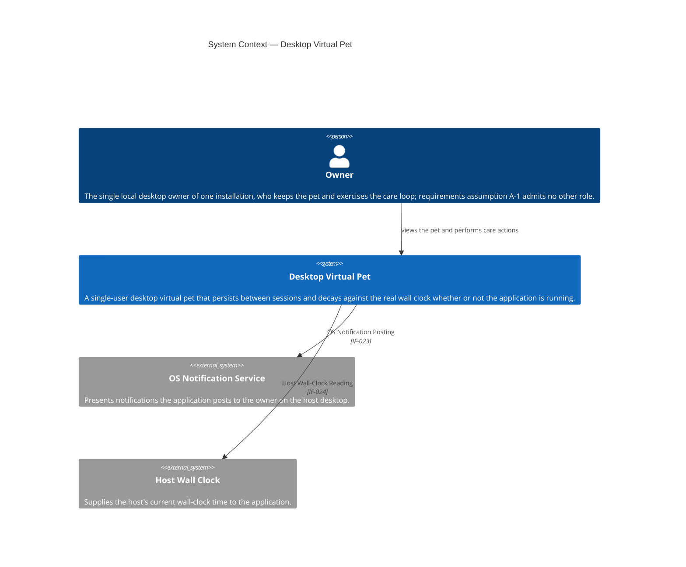
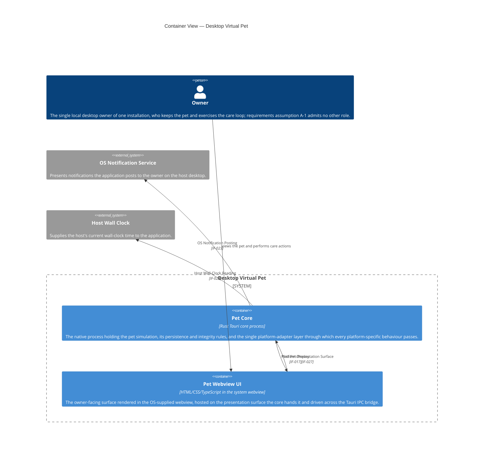
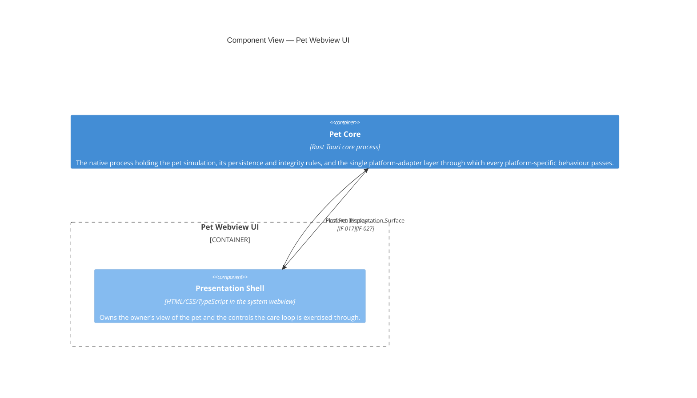

<!--
  GENERATED FILE — do not edit.
  Source: docs/requirements/examples/tamagotchi/design/diagrams/
  Regenerate: python3 site/scripts/export_examples.py
-->

# C4 diagrams

The 4 C4 diagrams from the `tamagotchi` worked example, exactly as the pipeline wrote them.

## DIA-001 — System Context [#dia-001]

| Field | Value |
| --- | --- |
| Type | diagram |
| Status | draft |
| Confidence | medium |
| C4 level | context |
| Traces from | [FR-001](/guide/examples/tamagotchi/requirements/functional/#fr-001), [FR-002](/guide/examples/tamagotchi/requirements/functional/#fr-002), [FR-008](/guide/examples/tamagotchi/requirements/functional/#fr-008), [FR-009](/guide/examples/tamagotchi/requirements/functional/#fr-009), [FR-011](/guide/examples/tamagotchi/requirements/functional/#fr-011), [FR-012](/guide/examples/tamagotchi/requirements/functional/#fr-012), [NFR-001](/guide/examples/tamagotchi/requirements/non-functional/#nfr-001), [NFR-002](/guide/examples/tamagotchi/requirements/non-functional/#nfr-002), [NFR-003](/guide/examples/tamagotchi/requirements/non-functional/#nfr-003), [NFR-004](/guide/examples/tamagotchi/requirements/non-functional/#nfr-004), [NFR-005](/guide/examples/tamagotchi/requirements/non-functional/#nfr-005), [NFR-006](/guide/examples/tamagotchi/requirements/non-functional/#nfr-006), [NFR-007](/guide/examples/tamagotchi/requirements/non-functional/#nfr-007), [NFR-008](/guide/examples/tamagotchi/requirements/non-functional/#nfr-008), [NFR-009](/guide/examples/tamagotchi/requirements/non-functional/#nfr-009), [CON-001](/guide/examples/tamagotchi/requirements/constraints/#con-001), [CON-002](/guide/examples/tamagotchi/requirements/constraints/#con-002), [CON-003](/guide/examples/tamagotchi/requirements/constraints/#con-003), [BR-001](/guide/examples/tamagotchi/requirements/business-rules/#br-001), [BR-002](/guide/examples/tamagotchi/requirements/business-rules/#br-002) |

## DIA-002 — Container View [#dia-002]

| Field | Value |
| --- | --- |
| Type | diagram |
| Status | draft |
| Confidence | medium |
| C4 level | container |
| Traces from | [BR-001](/guide/examples/tamagotchi/requirements/business-rules/#br-001), [BR-002](/guide/examples/tamagotchi/requirements/business-rules/#br-002), [CON-001](/guide/examples/tamagotchi/requirements/constraints/#con-001), [CON-002](/guide/examples/tamagotchi/requirements/constraints/#con-002), [CON-003](/guide/examples/tamagotchi/requirements/constraints/#con-003), [FR-001](/guide/examples/tamagotchi/requirements/functional/#fr-001), [FR-002](/guide/examples/tamagotchi/requirements/functional/#fr-002), [FR-003](/guide/examples/tamagotchi/requirements/functional/#fr-003), [FR-004](/guide/examples/tamagotchi/requirements/functional/#fr-004), [FR-005](/guide/examples/tamagotchi/requirements/functional/#fr-005), [FR-006](/guide/examples/tamagotchi/requirements/functional/#fr-006), [FR-007](/guide/examples/tamagotchi/requirements/functional/#fr-007), [FR-008](/guide/examples/tamagotchi/requirements/functional/#fr-008), [FR-009](/guide/examples/tamagotchi/requirements/functional/#fr-009), [FR-010](/guide/examples/tamagotchi/requirements/functional/#fr-010), [FR-011](/guide/examples/tamagotchi/requirements/functional/#fr-011), [FR-012](/guide/examples/tamagotchi/requirements/functional/#fr-012), [NFR-001](/guide/examples/tamagotchi/requirements/non-functional/#nfr-001), [NFR-002](/guide/examples/tamagotchi/requirements/non-functional/#nfr-002), [NFR-003](/guide/examples/tamagotchi/requirements/non-functional/#nfr-003), [NFR-004](/guide/examples/tamagotchi/requirements/non-functional/#nfr-004), [NFR-005](/guide/examples/tamagotchi/requirements/non-functional/#nfr-005), [NFR-006](/guide/examples/tamagotchi/requirements/non-functional/#nfr-006), [NFR-007](/guide/examples/tamagotchi/requirements/non-functional/#nfr-007), [NFR-008](/guide/examples/tamagotchi/requirements/non-functional/#nfr-008), [NFR-009](/guide/examples/tamagotchi/requirements/non-functional/#nfr-009) |

## DIA-003 — Component View — Pet Core [#dia-003]

| Field | Value |
| --- | --- |
| Type | diagram |
| Status | draft |
| Confidence | medium |
| C4 level | component |
| Traces from | [BR-001](/guide/examples/tamagotchi/requirements/business-rules/#br-001), [BR-002](/guide/examples/tamagotchi/requirements/business-rules/#br-002), [CON-002](/guide/examples/tamagotchi/requirements/constraints/#con-002), [CON-003](/guide/examples/tamagotchi/requirements/constraints/#con-003), [FR-001](/guide/examples/tamagotchi/requirements/functional/#fr-001), [FR-002](/guide/examples/tamagotchi/requirements/functional/#fr-002), [FR-003](/guide/examples/tamagotchi/requirements/functional/#fr-003), [FR-004](/guide/examples/tamagotchi/requirements/functional/#fr-004), [FR-005](/guide/examples/tamagotchi/requirements/functional/#fr-005), [FR-006](/guide/examples/tamagotchi/requirements/functional/#fr-006), [FR-007](/guide/examples/tamagotchi/requirements/functional/#fr-007), [FR-008](/guide/examples/tamagotchi/requirements/functional/#fr-008), [FR-009](/guide/examples/tamagotchi/requirements/functional/#fr-009), [FR-010](/guide/examples/tamagotchi/requirements/functional/#fr-010), [FR-011](/guide/examples/tamagotchi/requirements/functional/#fr-011), [FR-012](/guide/examples/tamagotchi/requirements/functional/#fr-012), [NFR-001](/guide/examples/tamagotchi/requirements/non-functional/#nfr-001), [NFR-002](/guide/examples/tamagotchi/requirements/non-functional/#nfr-002), [NFR-003](/guide/examples/tamagotchi/requirements/non-functional/#nfr-003), [NFR-004](/guide/examples/tamagotchi/requirements/non-functional/#nfr-004), [NFR-005](/guide/examples/tamagotchi/requirements/non-functional/#nfr-005), [NFR-006](/guide/examples/tamagotchi/requirements/non-functional/#nfr-006), [NFR-007](/guide/examples/tamagotchi/requirements/non-functional/#nfr-007), [NFR-008](/guide/examples/tamagotchi/requirements/non-functional/#nfr-008), [NFR-009](/guide/examples/tamagotchi/requirements/non-functional/#nfr-009) |

```mermaid
C4Component
  title Component View — Pet Core
  Container_Boundary(ctr_pet_core, "Pet Core") {
    Component(cmp_001, "Pet State Model", "Rust Tauri core process", "Owns the pet state representation and its invariants, including construction of a default pet.")
    Component(cmp_002, "Balance Configuration", "Rust Tauri core process", "Supplies the pet's balance and tuning parameters to the components that read them.")
    Component(cmp_003, "Pet Session", "Rust Tauri core process", "Holds the application's live pet state as its sole custodian, mediating every read of it, every replacement of it and every commit of it to durable storage.")
    Component(cmp_004, "Decay Engine", "Rust Tauri core process", "Computes the decayed pet state for a given starting pet state and elapsed interval.")
    Component(cmp_005, "Health Progression", "Rust Tauri core process", "Advances the pet's health status under sustained unremedied neglect.")
    Component(cmp_006, "Sleep Cycle", "Rust Tauri core process", "Owns the pet's Awake/Sleeping transitions and the sleep-entry timestamp they turn on.")
    Component(cmp_007, "Mood Expression Selector", "Rust Tauri core process", "Selects the pet's mood expression from the band containing its lowest stat value.")
    Component(cmp_008, "Care Interaction Handler", "Rust Tauri core process", "Applies an owner-selected care-loop action to the current pet.")
    Component(cmp_009, "Pet State Evaluator", "Rust Tauri core process", "Performs a pet-state evaluation, re-deriving the current pet state from the wall clock.")
    Component(cmp_010, "Evaluation Scheduler", "Rust Tauri core process", "Drives recurring pet-state evaluation while the application is running.")
    Component(cmp_011, "Application Lifecycle Sequencer", "Rust Tauri core process", "Orders the application's session boundaries, from launch through to close.")
    Component(cmp_012, "Pet State Store", "Rust Tauri core process", "Owns custody of the pet state save file as the system's single system of record.")
    Component(cmp_013, "Save Integrity Validator", "Rust Tauri core process", "Establishes whether a save file's contents are a committed state.")
    Component(cmp_014, "Care Reminder Service", "Rust Tauri core process", "Owns the optional care-reminder feature, from the owner's enablement of it through to the reminder it raises.")
    Component(cmp_015, "Diagnostic Log", "Rust Tauri core process", "Writes the structured local record for each decay computation and lifecycle transition.")
    Component(cmp_017, "Platform Adapter", "Rust Tauri core process", "Confines every platform-specific behaviour to one layer so the rest of the codebase stays platform-agnostic.")
  }
  Container(ctr_webview_ui, "Pet Webview UI", "HTML/CSS/TypeScript in the system webview", "The owner-facing surface rendered in the OS-supplied webview, hosted on the presentation surface the core hands it and driven across the Tauri IPC bridge.")
  System_Ext(ext_cmp_018, "OS Notification Service", "Presents notifications the application posts to the owner on the host desktop.")
  System_Ext(ext_cmp_019, "Host Wall Clock", "Supplies the host's current wall-clock time to the application.")
  Rel(cmp_001, cmp_002, "Balance Parameter Read", "IF-001")
  Rel(cmp_002, cmp_017, "Local Data Directory File Read", "IF-019")
  Rel(cmp_003, cmp_012, "Pet State Commit", "IF-013")
  Rel(cmp_004, cmp_002, "Balance Parameter Read", "IF-001")
  Rel(cmp_005, cmp_002, "Balance Parameter Read", "IF-001")
  Rel(cmp_005, cmp_015, "Diagnostic Event Recording", "IF-016")
  Rel(cmp_005, cmp_017, "Host Clock Access", "IF-018")
  Rel(cmp_006, cmp_002, "Balance Parameter Read", "IF-001")
  Rel(cmp_006, cmp_015, "Diagnostic Event Recording", "IF-016")
  Rel(cmp_006, cmp_017, "Host Clock Access", "IF-018")
  Rel(cmp_007, cmp_002, "Balance Parameter Read", "IF-001")
  Rel(cmp_007, cmp_015, "Diagnostic Event Recording", "IF-016")
  Rel(cmp_008, cmp_002, "Balance Parameter Read", "IF-001")
  Rel(cmp_008, cmp_003, "Live Pet State Access", "IF-002")
  Rel(cmp_008, cmp_006, "Sleep Entry", "IF-005")
  Rel(cmp_008, cmp_007, "Mood Expression Selection", "IF-007")
  Rel(cmp_009, cmp_003, "Live Pet State Access", "IF-002")
  Rel(cmp_009, cmp_004, "Decay Computation", "IF-003")
  Rel(cmp_009, cmp_005, "Health Progression Advance", "IF-004")
  Rel(cmp_009, cmp_006, "Wake Deadline Resolution", "IF-006")
  Rel(cmp_009, cmp_007, "Mood Expression Selection", "IF-007")
  Rel(cmp_009, cmp_014, "Care Reminder Raising", "IF-015")
  Rel(cmp_009, cmp_015, "Diagnostic Event Recording", "IF-016")
  Rel(cmp_009, ctr_webview_ui, "Pet View Refresh", "IF-030")
  Rel(cmp_009, cmp_017, "Host Clock Access", "IF-018")
  Rel(cmp_010, cmp_009, "Pet-State Evaluation", "IF-009")
  Rel(cmp_010, cmp_017, "Platform Recurring Timer", "IF-031")
  Rel(cmp_011, cmp_001, "Default Pet Construction", "IF-011")
  Rel(cmp_011, cmp_002, "Balance Configuration Load", "IF-026")
  Rel(cmp_011, cmp_003, "Live Pet State Access", "IF-002")
  Rel(cmp_011, cmp_003, "Session-End State Commit", "IF-029")
  Rel(cmp_011, cmp_009, "Pet-State Evaluation", "IF-009")
  Rel(cmp_011, cmp_010, "Recurring Evaluation Cadence", "IF-010")
  Rel(cmp_011, cmp_012, "Committed Save Retrieval", "IF-012")
  Rel(cmp_011, cmp_015, "Diagnostic Event Recording", "IF-016")
  Rel(cmp_011, ctr_webview_ui, "First Pet Display", "IF-017")
  Rel(cmp_012, cmp_013, "Save Integrity Validation", "IF-014")
  Rel(cmp_012, cmp_015, "Diagnostic Event Recording", "IF-016")
  Rel(cmp_012, cmp_017, "Host Clock Access", "IF-018")
  Rel(cmp_012, cmp_017, "Local Data Directory File Read", "IF-019")
  Rel(cmp_012, cmp_017, "Save File Quarantine Move", "IF-020")
  Rel(cmp_012, cmp_017, "Local Data Directory Atomic File Replace", "IF-025")
  Rel(cmp_014, cmp_002, "Balance Parameter Read", "IF-001")
  Rel(cmp_014, cmp_017, "Local Data Directory File Read", "IF-019")
  Rel(cmp_014, cmp_017, "Local Notification Presentation", "IF-022")
  Rel(cmp_014, cmp_017, "Local Data Directory Atomic File Replace", "IF-025")
  Rel(cmp_015, cmp_017, "Host Clock Access", "IF-018")
  Rel(cmp_015, cmp_017, "Diagnostic Log File Append and Rotation", "IF-021")
  Rel(ctr_webview_ui, cmp_003, "Live Pet State Access", "IF-002")
  Rel(ctr_webview_ui, cmp_008, "Care Action Application", "IF-008")
  Rel(ctr_webview_ui, cmp_014, "Care Reminder Preference", "IF-028")
  Rel(ctr_webview_ui, cmp_017, "Platform Presentation Surface", "IF-027")
  Rel(cmp_017, ext_cmp_018, "OS Notification Posting", "IF-023")
  Rel(cmp_017, ext_cmp_019, "Host Wall-Clock Reading", "IF-024")
```

## DIA-004 — Component View — Pet Webview UI [#dia-004]

| Field | Value |
| --- | --- |
| Type | diagram |
| Status | draft |
| Confidence | medium |
| C4 level | component |
| Traces from | [CON-001](/guide/examples/tamagotchi/requirements/constraints/#con-001), [CON-003](/guide/examples/tamagotchi/requirements/constraints/#con-003), [FR-003](/guide/examples/tamagotchi/requirements/functional/#fr-003), [FR-004](/guide/examples/tamagotchi/requirements/functional/#fr-004), [FR-005](/guide/examples/tamagotchi/requirements/functional/#fr-005), [FR-006](/guide/examples/tamagotchi/requirements/functional/#fr-006), [FR-007](/guide/examples/tamagotchi/requirements/functional/#fr-007), [FR-009](/guide/examples/tamagotchi/requirements/functional/#fr-009), [NFR-002](/guide/examples/tamagotchi/requirements/non-functional/#nfr-002), [NFR-003](/guide/examples/tamagotchi/requirements/non-functional/#nfr-003), [NFR-006](/guide/examples/tamagotchi/requirements/non-functional/#nfr-006) |

