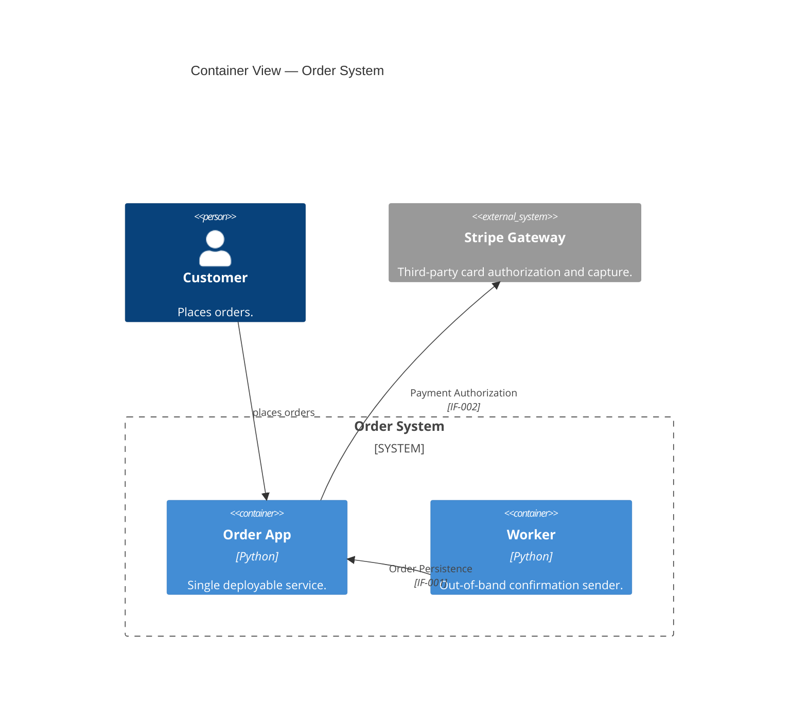

# Container View

```mermaid
C4Container
  title Container View — Order System
  Person(actor_customer, "Customer", "Places orders.")
  System_Boundary(sys, "Order System") {
    Container(ctr_app, "Order App", "Python", "Single deployable service.")
    Container(ctr_worker, "Worker", "Python", "Out-of-band confirmation sender.")
  }
  System_Ext(ext_cmp_003, "Stripe Gateway", "Third-party card authorization and capture.")
  Rel(actor_customer, ctr_app, "places orders")
  Rel(ctr_app, ext_cmp_003, "Payment Authorization", "IF-002")
  Rel(ctr_worker, ctr_app, "Order Persistence", "IF-001")
```
