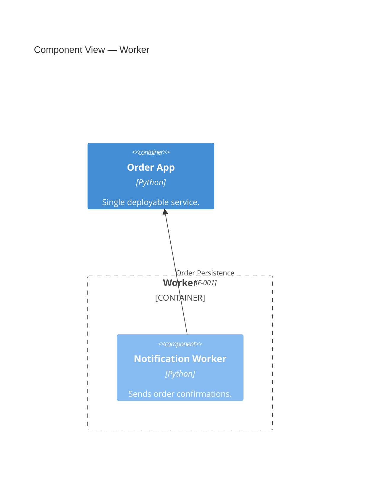

# Component View — Worker

```mermaid
C4Component
  title Component View — Worker
  Container_Boundary(ctr_worker, "Worker") {
    Component(cmp_004, "Notification Worker", "Python", "Sends order confirmations.")
  }
  Container(ctr_app, "Order App", "Python", "Single deployable service.")
  Rel(cmp_004, ctr_app, "Order Persistence", "IF-001")
```
