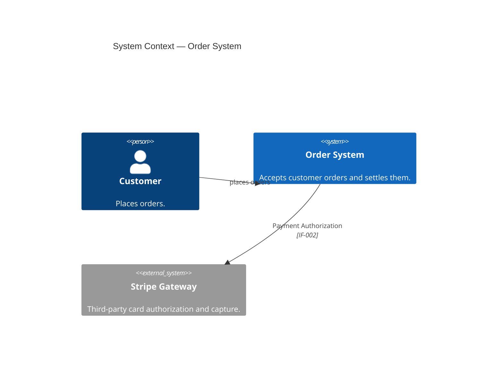

# System Context

```mermaid
C4Context
  title System Context — Order System
  Person(actor_customer, "Customer", "Places orders.")
  System(sys, "Order System", "Accepts customer orders and settles them.")
  System_Ext(ext_cmp_003, "Stripe Gateway", "Third-party card authorization and capture.")
  Rel(actor_customer, sys, "places orders")
  Rel(sys, ext_cmp_003, "Payment Authorization", "IF-002")
```
