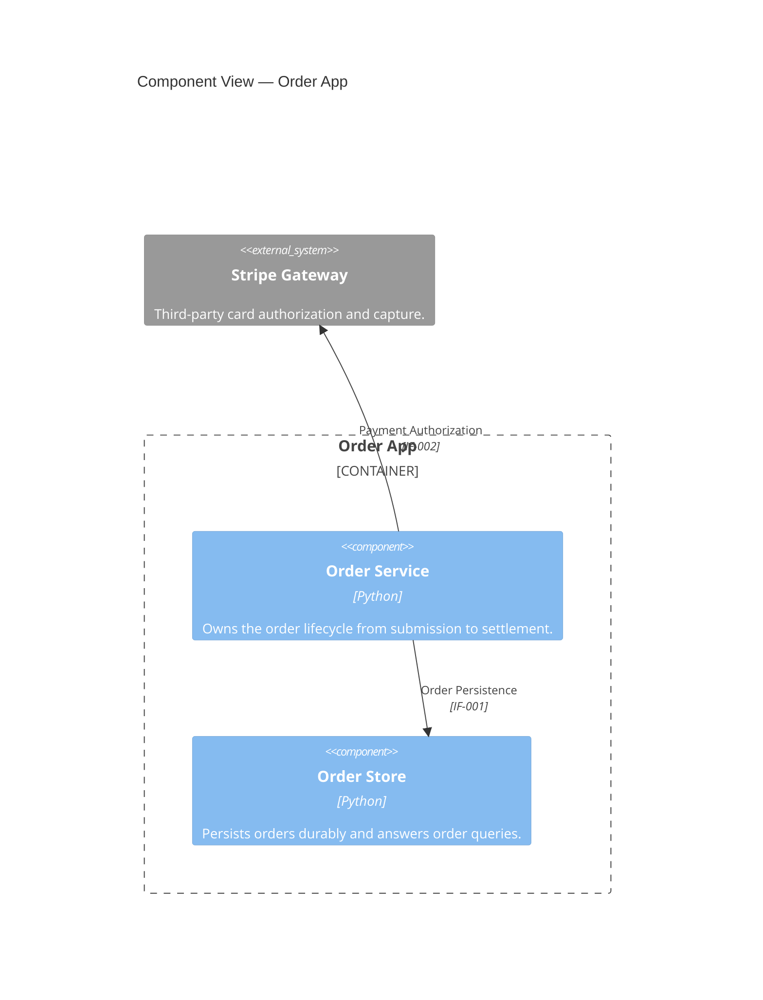

# Component View — Order App

```mermaid
C4Component
  title Component View — Order App
  Container_Boundary(ctr_app, "Order App") {
    Component(cmp_001, "Order Service", "Python", "Owns the order lifecycle from submission to settlement.")
    Component(cmp_002, "Order Store", "Python", "Persists orders durably and answers order queries.")
  }
  System_Ext(ext_cmp_003, "Stripe Gateway", "Third-party card authorization and capture.")
  Rel(cmp_001, cmp_002, "Order Persistence", "IF-001")
  Rel(cmp_001, ext_cmp_003, "Payment Authorization", "IF-002")
```
