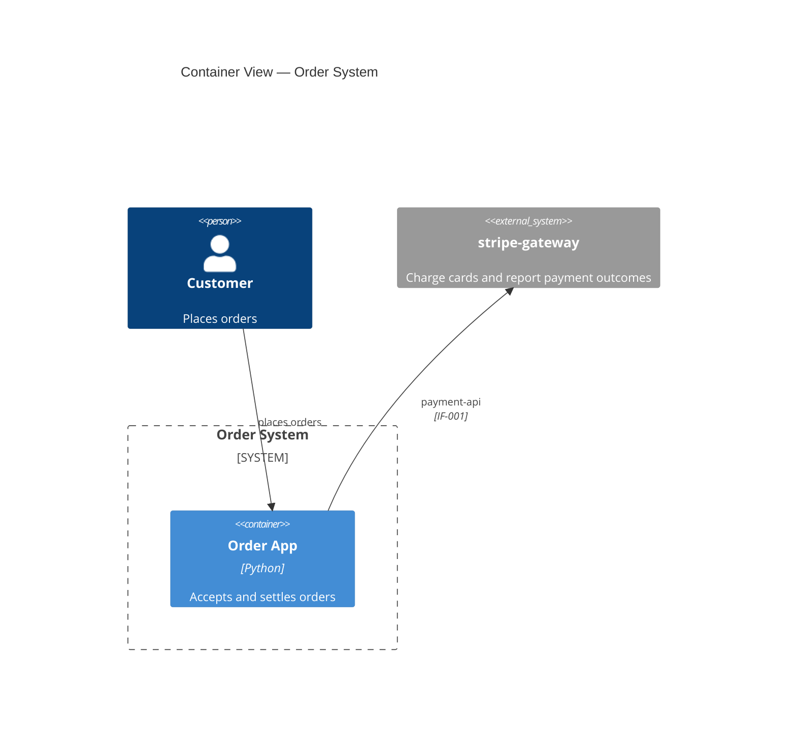

# Container View

```mermaid
C4Container
  title Container View — Order System
  Person(actor_customer, "Customer", "Places orders")
  System_Boundary(sys, "Order System") {
    Container(ctr_app, "Order App", "Python", "Accepts and settles orders")
  }
  System_Ext(ext_cmp_002, "stripe-gateway", "Charge cards and report payment outcomes")
  Rel(actor_customer, ctr_app, "places orders")
  Rel(ctr_app, ext_cmp_002, "payment-api", "IF-001")
```
