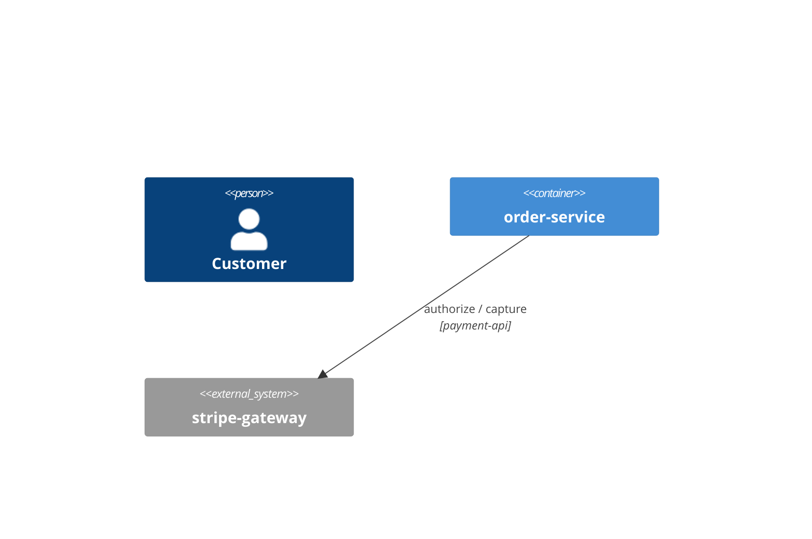

# C4 Container diagram

Lives under `diagrams/`, whose format STO-101 owns. Skipped by the validator's
discovery, exactly like `adr/`.

```mermaid
C4Container
  Person(customer, "Customer")
  Container(order, "order-service")
  System_Ext(stripe, "stripe-gateway")
  Rel(order, stripe, "authorize / capture", "payment-api")
```
